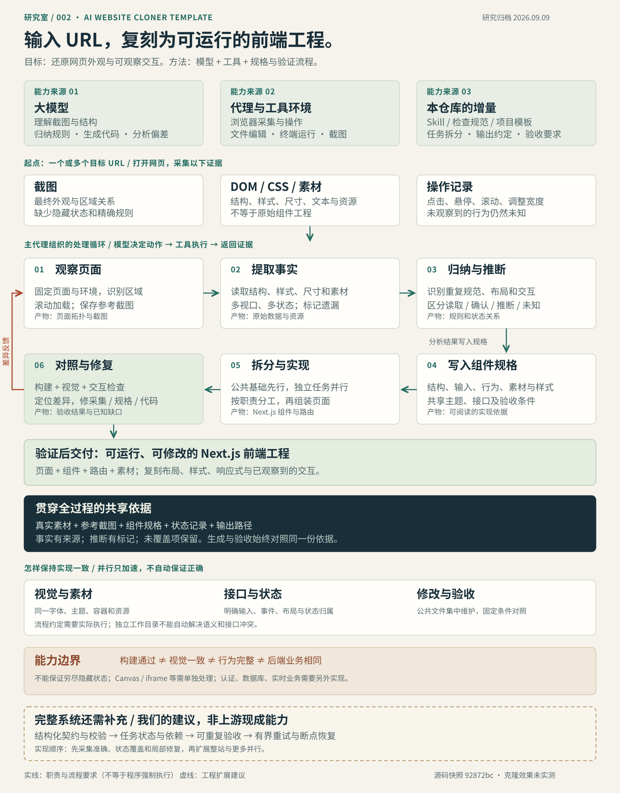
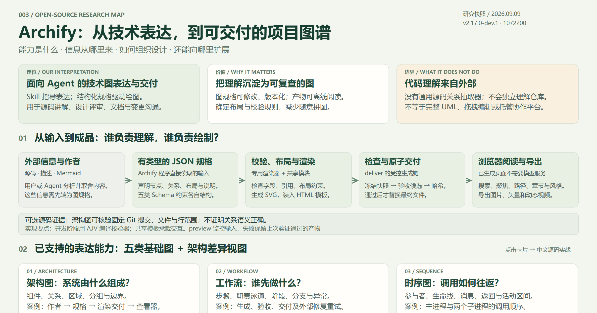

# GitHub 项目研究室

持续研究遇到的优秀开源项目，记录它们解决的问题、实现思路、运行方法和可复用的经验。每个项目独立整理研究笔记、截图和可选的 Web 演示，这里只保留摘要与入口。

**阅读路线：** 浏览项目摘要与概览图 → 进入项目研究页 → 查看技术解释、运行方法与交互演示。

## 项目索引

<!-- PROJECT_INDEX:START -->
| 顺序 | 编号 | 项目 | 一句话摘要 | 状态 | Web |
| --- | --- | --- | --- | --- | --- |
| 1 | 001 | [提示词工程交互教程](projects/001-prompt-eng-interactive-tutorial/README.md) | Anthropic 官方交互式提示词课程：通过 9 章 Notebook 学习任务定义、示例、格式与证据约束，并用调用反馈迭代；附录介绍提示词链、工具调用、评估和检索扩展。 | 已整理 | [演示](https://yydshly.github.io/0909_codex_project/projects/001-prompt-eng-interactive-tutorial/) |
| 2 | 002 | [URL 驱动的 AI 网页复刻](projects/002-ai-website-cloner-template/README.md) | 输入一个或多个目标 URL，借助 AI 编程代理复刻网页布局、样式、素材和可观察交互，生成可修改的 Next.js 前端工程；以规格和验证流程减少执行遗漏。 | 已归档 | [演示](https://yydshly.github.io/0909_codex_project/projects/002-ai-website-cloner-template/) |
| 3 | 003 | [Archify 能力与设计图谱](projects/003-archify/README.md) | 完整研究展厅：介绍 Archify 能力与原理，直接展示原库六个样例、研究仓库和 Archify 自身两个案例，并整合导出、验证、设计体系与扩展方向。 | 已整理 | [演示](https://yydshly.github.io/0909_codex_project/projects/003-archify/) |
<!-- PROJECT_INDEX:END -->

## 项目速览

<!-- PROJECT_CARDS:START -->
### 001 · 提示词工程交互教程

Anthropic 官方交互式提示词课程：通过 9 章 Notebook 学习任务定义、示例、格式与证据约束，并用调用反馈迭代；附录介绍提示词链、工具调用、评估和检索扩展。


[研究记录](projects/001-prompt-eng-interactive-tutorial/README.md) · [上游仓库](https://github.com/anthropics/prompt-eng-interactive-tutorial) · [Web 演示](https://yydshly.github.io/0909_codex_project/projects/001-prompt-eng-interactive-tutorial/)

### 002 · URL 驱动的 AI 网页复刻

输入一个或多个目标 URL，借助 AI 编程代理复刻网页布局、样式、素材和可观察交互，生成可修改的 Next.js 前端工程；以规格和验证流程减少执行遗漏。



[研究记录](projects/002-ai-website-cloner-template/README.md) · [上游仓库](https://github.com/JCodesMore/ai-website-cloner-template) · [Web 演示](https://yydshly.github.io/0909_codex_project/projects/002-ai-website-cloner-template/)

### 003 · Archify 能力与设计图谱

完整研究展厅：介绍 Archify 能力与原理，直接展示原库六个样例、研究仓库和 Archify 自身两个案例，并整合导出、验证、设计体系与扩展方向。



[研究记录](projects/003-archify/README.md) · [上游仓库](https://github.com/tt-a1i/archify) · [Web 演示](https://yydshly.github.io/0909_codex_project/projects/003-archify/)
<!-- PROJECT_CARDS:END -->

## 001 · 架构图阅读指南

上方图总结了 **Anthropic 提示词工程交互教程** 的内容组织与运行机制。它是一套学习如何设计 AI 任务的交互课程，适用于分类、问答、写作和辅助开发；其核心是组织上下文并验证输出，不涉及模型训练。

**沿图从上到下阅读：** Notebook 学习入口 → 第 1–9 章核心技术 → 提示词组装、API 调用与反馈循环 → 附录扩展 → 应用与当前价值。实线框表示已有教学示例，RAG 的虚线框表示延伸阅读入口；生产评测平台和完整知识库仍需另行建设。

[放大查看整体架构图](projects/001-prompt-eng-interactive-tutorial/web/assets/architecture.svg) · [阅读 12 项技术的简明解释](projects/001-prompt-eng-interactive-tutorial/README.md#core-techniques) · [查看来源与能力边界](projects/001-prompt-eng-interactive-tutorial/notes/sources.md)

## 仓库结构

```text
projects/                 各子项目：研究页、图片、实验代码、可选 Web
registry/projects.json    项目清单：稳定编号、展示顺序、摘要和状态
templates/project/        新项目模板
site/                     总览网页模板与样式
scripts/catalog.py        创建项目、同步索引、生成静态站点
docs/                     收录约定与部署指南
.github/workflows/        校验流程与手动发布流程
```

## 开始收录

需要 Python 3.10 或更新版本，无需安装第三方依赖。在仓库根目录执行：

```sh
python scripts/catalog.py new example-repo --name "项目名称" --url "https://github.com/owner/repo" --summary "一句话描述项目与研究重点"
python scripts/catalog.py check
python scripts/catalog.py build
python -m http.server 8000 --directory _site
```

`example-repo` 是命令用法示例，尚未收录为真实项目。创建命令会分配编号、生成研究目录，并同步本页索引。随后填写项目研究页，将截图放入 `assets/`；需要封面时，在清单中设置 `cover`，例如 `assets/cover.png`。

编辑项目清单后运行 `python scripts/catalog.py sync` 更新本页。展示顺序由 `order` 决定；编号与目录保持稳定。

## 维护与发布

- [项目收录、编号与图片约定](docs/project-guide.md)
- [Web 演示与 GitHub Pages 部署](docs/deployment.md)
- [项目元数据清单](registry/projects.json)

GitHub Pages 已启用并完成发布：[访问在线研究室](https://yydshly.github.io/0909_codex_project/)。资料推送只触发检查，网页更新还需运行手动发布流程，详见部署指南。上游项目的代码与素材应注明来源及原有许可。
