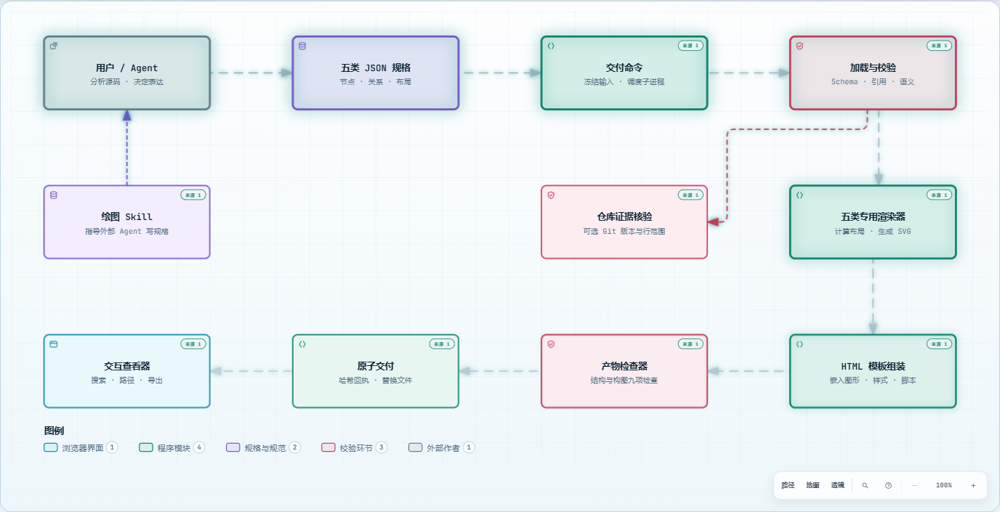
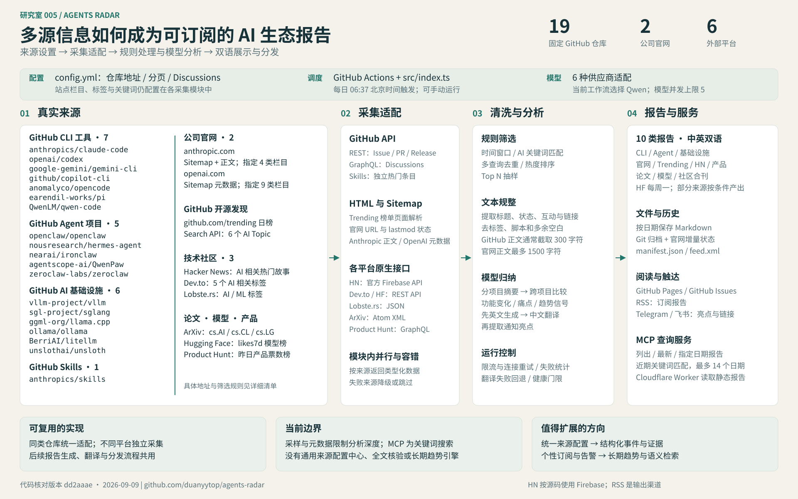
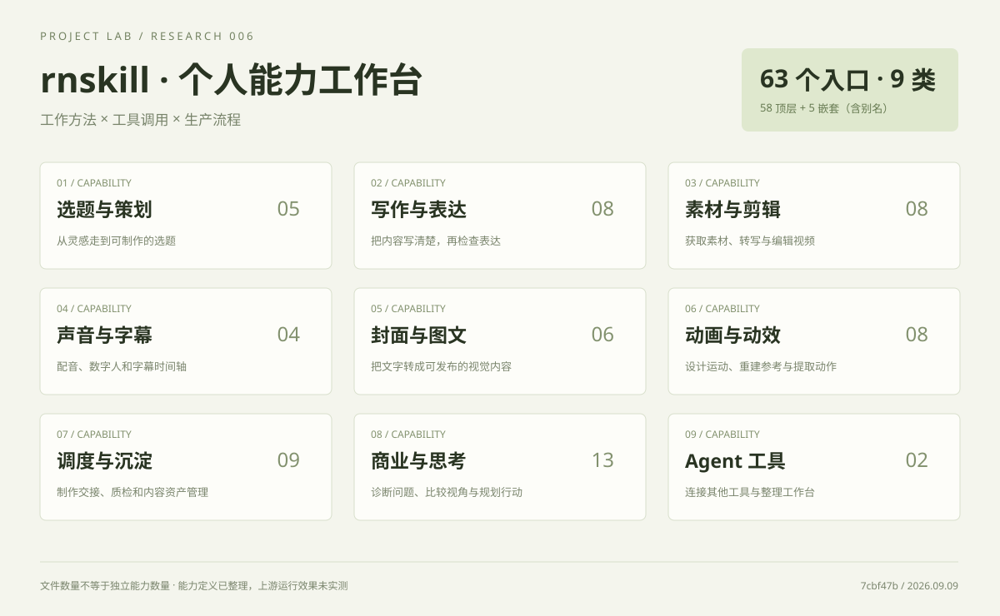
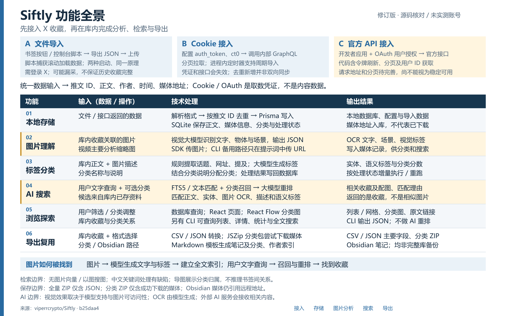
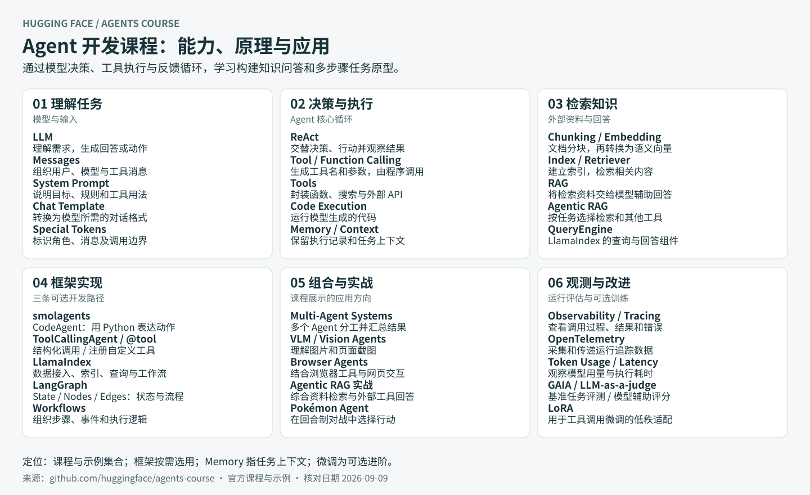
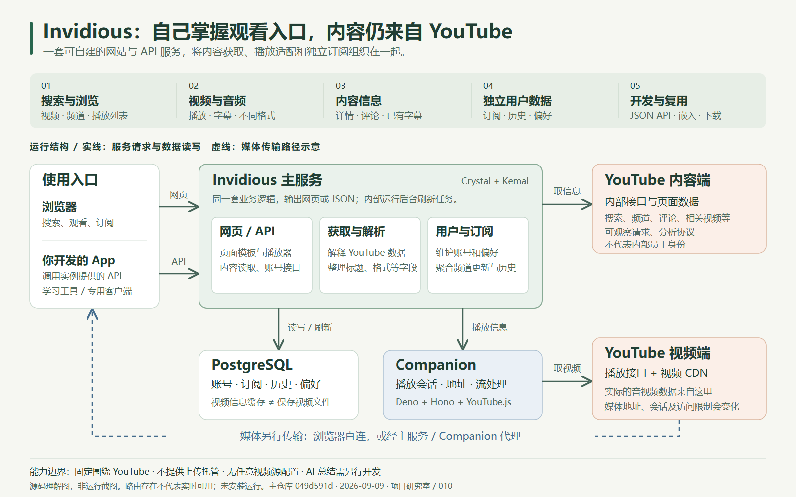
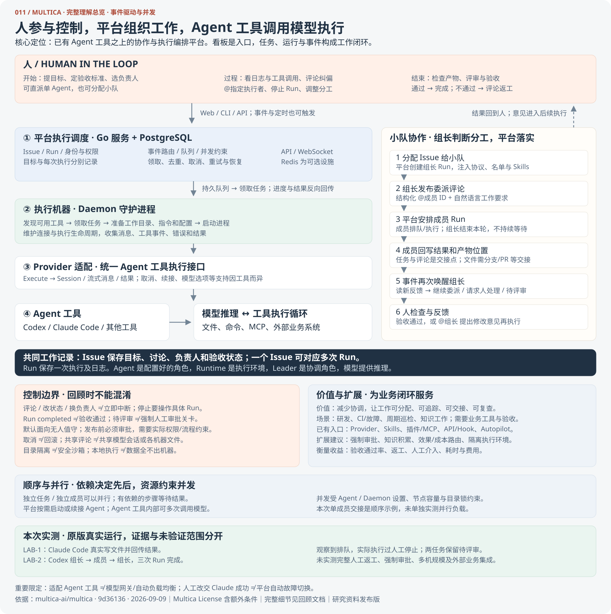

# GitHub 项目研究室

持续研究遇到的优秀开源项目，记录它们解决的问题、实现思路、运行方法和可复用的经验。每个项目独立整理研究笔记、截图和可选的 Web 演示，这里只保留摘要与入口。

**阅读路线：** 浏览项目摘要与概览图 → 进入项目研究页 → 查看技术解释、运行方法与交互演示。

## 项目索引

<!-- PROJECT_INDEX:START -->
| 顺序 | 编号 | 项目 | 源库 | 一句话摘要 | 状态 | Web |
| --- | --- | --- | --- | --- | --- | --- |
| 1 | 001 | [提示词工程交互教程](projects/001-prompt-eng-interactive-tutorial/README.md) | [anthropics/prompt-eng-interactive-tutorial](https://github.com/anthropics/prompt-eng-interactive-tutorial) | Anthropic 官方交互式提示词课程：通过 9 章 Notebook 学习任务定义、示例、格式与证据约束，并用调用反馈迭代；附录介绍提示词链、工具调用、评估和检索扩展。 | 已整理 | [演示](https://yydshly.github.io/0909_codex_project/projects/001-prompt-eng-interactive-tutorial/) |
| 2 | 002 | [URL 驱动的 AI 网页复刻](projects/002-ai-website-cloner-template/README.md) | [JCodesMore/ai-website-cloner-template](https://github.com/JCodesMore/ai-website-cloner-template) | 输入一个或多个目标 URL，借助 AI 编程代理复刻网页布局、样式、素材和可观察交互，生成可修改的 Next.js 前端工程；以规格和验证流程减少执行遗漏。 | 已归档 | [演示](https://yydshly.github.io/0909_codex_project/projects/002-ai-website-cloner-template/) |
| 3 | 003 | [Archify 能力与设计图谱](projects/003-archify/README.md) | [tt-a1i/archify](https://github.com/tt-a1i/archify) | 将用户或 Agent 编写的 JSON 规格渲染为交互式架构图、工作流、时序图、数据流和生命周期图，支持架构模型差异与多格式导出；用于系统讲解、设计评审和重构沟通，以可校验、可复现的图形交付提升沟通效率，可扩展代码关系提取、UML/ER 图及 CI 文档更新。 | 已整理 | [演示](https://yydshly.github.io/0909_codex_project/projects/003-archify/) |
| 4 | 004 | [中文手绘解释图展厅](projects/004-ian-handdrawn-ppt/README.md) | [helloianneo/ian-handdrawn-ppt](https://github.com/helloianneo/ian-handdrawn-ppt) | 输入想法、文章或观点，AI 按库的规则提炼信息、编排思路并生成风格统一的演示页面 PNG；用整体引导图、原作与真实场景实作展示能力，明确图像式演示稿与可编辑 PPTX 的区别。 | 已整理 | [演示](https://yydshly.github.io/0909_codex_project/projects/004-ian-handdrawn-ppt/) |
| 5 | 005 | [Agents Radar 多源情报架构](projects/005-agents-radar/README.md) | [duanyytop/agents-radar](https://github.com/duanyytop/agents-radar) | 拆解 19 个 GitHub 仓库、2 家官网及社区、论文、模型和产品平台的来源配置、采集适配、文本处理与双语报告分发，附一页全景图与完整来源清单。 | 已整理 | [演示](https://yydshly.github.io/0909_codex_project/projects/005-agents-radar/) |
| 6 | 006 | [rnskill 个人能力工作台](projects/006-rnskill/README.md) | [Pluviobyte/rnskill](https://github.com/Pluviobyte/rnskill) | rnskill 将选题、写作、配音字幕、视觉制作与商业诊断整理为 Agent 技能，通过 SKILL.md 指导模型调用脚本、工具和外部服务，以文件交接和质检衔接流程；适用于个人自媒体、课程教程、产品演示和内容资产管理。 | 已整理 | [演示](https://yydshly.github.io/0909_codex_project/projects/006-rnskill/) |
| 7 | 007 | [HeliosGen AI 创作工作台](projects/007-heliosgen/README.md) | [SegFault42/HeliosGen](https://github.com/SegFault42/HeliosGen) | 面向图片与视频创作的桌面应用，支持提示词辅助、节点工作流与本地素材管理；通过云端模型 API 适配和依赖调度串联生成任务，减少重复操作、复用创作流程；可扩展更多模型、本地推理、任务恢复、成本控制与行业模板。 | 已整理 | [演示](https://yydshly.github.io/0909_codex_project/projects/007-heliosgen/) |
| 8 | 008 | [Siftly X 收藏知识库](projects/008-siftly/README.md) | [viperrcrypto/Siftly](https://github.com/viperrcrypto/Siftly) | 面向个人的自托管 X 收藏知识库，通过文件、Cookie 或官方 API 路径获取收藏，使用 SQLite 存储、视觉大模型提取图片信息，并以全文召回和大模型重排实现自然语言查找；适合工具资料整理、教程检索、视觉素材回找与 Obsidian 积累。 | 已整理 | [演示](https://yydshly.github.io/0909_codex_project/projects/008-siftly/) |
| 9 | 009 | [Hugging Face Agent 开发课程](projects/009-agents-course/README.md) | [huggingface/agents-course](https://github.com/huggingface/agents-course) | Hugging Face 的 Agent 开发课程与示例集：通过模型决策、工具执行和反馈循环，结合检索增强与状态编排，讲解 smolagents、LlamaIndex、LangGraph 的实现；适合学习工具调用、构建知识问答与多步骤任务原型，并通过评估改进效果。 | 已整理 | [演示](https://yydshly.github.io/0909_codex_project/projects/009-agents-course/) |
| 10 | 010 | [Invidious 能力与架构分析](projects/010-invidious/README.md) | [iv-org/invidious](https://github.com/iv-org/invidious) | 一图解释 Invidious 的 YouTube 内容获取、独立账号与订阅、Companion 播放链路及对外 API；网页用搜索、播放、订阅三个流程澄清数据来源、组件分工和能力边界，未运行上游服务。 | 已整理 | [演示](https://yydshly.github.io/0909_codex_project/projects/010-invidious/) |
| 11 | 011 | [Multica Agent 协作与执行平台](projects/011-multica/README.md) | [multica-ai/multica](https://github.com/multica-ai/multica) | 以事件触发和任务队列调度 Codex、Claude Code 等 Agent 工具，支持依赖交接、并行执行与人工评审控制；附整体架构、完整理解和本机原版实测。 | 已整理 | [演示](https://yydshly.github.io/0909_codex_project/projects/011-multica/) |
| 12 | 012 | [MetaGPT 多 Agent 软件团队实验室](projects/012-metagpt/README.md) | [FoundationAgents/MetaGPT](https://github.com/FoundationAgents/MetaGPT) | 以角色、动作、消息和异步循环组织多 Agent 协作：提示词定义工作方式，模型决策与程序调度分工；附两种调度机制、27 个角色及测试返修实测。 | 已整理 | [演示](https://yydshly.github.io/0909_codex_project/projects/012-metagpt/) |
| 13 | 013 | [Firecrawl 网页获取与能力实验室](projects/013-firecrawl/README.md) | [firecrawl/firecrawl](https://github.com/firecrawl/firecrawl) | Firecrawl 是网页数据获取服务，以 API/SDK 接收网址、搜索词与任务，通过 HTTP 请求、浏览器渲染、队列调度和内容转换输出 Markdown/JSON；支持搜索、抓取、爬站及云端交互，可用于新闻补全文与知识库，扩展持续更新、行业字段与质量校验，并明确登录和平台封号边界。 | 已整理 | [演示](https://yydshly.github.io/0909_codex_project/projects/013-firecrawl/) |
<!-- PROJECT_INDEX:END -->

## 项目速览

<!-- PROJECT_CARDS:START -->
### 001 · 提示词工程交互教程

Anthropic 官方交互式提示词课程：通过 9 章 Notebook 学习任务定义、示例、格式与证据约束，并用调用反馈迭代；附录介绍提示词链、工具调用、评估和检索扩展。


[研究记录](projects/001-prompt-eng-interactive-tutorial/README.md) · [上游仓库](https://github.com/anthropics/prompt-eng-interactive-tutorial) · [Web 演示](https://yydshly.github.io/0909_codex_project/projects/001-prompt-eng-interactive-tutorial/)

### 002 · URL 驱动的 AI 网页复刻

输入一个或多个目标 URL，借助 AI 编程代理复刻网页布局、样式、素材和可观察交互，生成可修改的 Next.js 前端工程；以规格和验证流程减少执行遗漏。


[研究记录](projects/002-ai-website-cloner-template/README.md) · [上游仓库](https://github.com/JCodesMore/ai-website-cloner-template) · [Web 演示](https://yydshly.github.io/0909_codex_project/projects/002-ai-website-cloner-template/)

### 003 · Archify 能力与设计图谱

将用户或 Agent 编写的 JSON 规格渲染为交互式架构图、工作流、时序图、数据流和生命周期图，支持架构模型差异与多格式导出；用于系统讲解、设计评审和重构沟通，以可校验、可复现的图形交付提升沟通效率，可扩展代码关系提取、UML/ER 图及 CI 文档更新。


**实际效果预览** · 点击图片进入演示与说明。

[](https://yydshly.github.io/0909_codex_project/projects/003-archify/)

[研究记录](projects/003-archify/README.md) · [上游仓库](https://github.com/tt-a1i/archify) · [Web 演示](https://yydshly.github.io/0909_codex_project/projects/003-archify/)

### 004 · 中文手绘解释图展厅

输入想法、文章或观点，AI 按库的规则提炼信息、编排思路并生成风格统一的演示页面 PNG；用整体引导图、原作与真实场景实作展示能力，明确图像式演示稿与可编辑 PPTX 的区别。


[研究记录](projects/004-ian-handdrawn-ppt/README.md) · [上游仓库](https://github.com/helloianneo/ian-handdrawn-ppt) · [Web 演示](https://yydshly.github.io/0909_codex_project/projects/004-ian-handdrawn-ppt/)

### 005 · Agents Radar 多源情报架构

拆解 19 个 GitHub 仓库、2 家官网及社区、论文、模型和产品平台的来源配置、采集适配、文本处理与双语报告分发，附一页全景图与完整来源清单。



[研究记录](projects/005-agents-radar/README.md) · [上游仓库](https://github.com/duanyytop/agents-radar) · [Web 演示](https://yydshly.github.io/0909_codex_project/projects/005-agents-radar/)

### 006 · rnskill 个人能力工作台

rnskill 将选题、写作、配音字幕、视觉制作与商业诊断整理为 Agent 技能，通过 SKILL.md 指导模型调用脚本、工具和外部服务，以文件交接和质检衔接流程；适用于个人自媒体、课程教程、产品演示和内容资产管理。



[研究记录](projects/006-rnskill/README.md) · [上游仓库](https://github.com/Pluviobyte/rnskill) · [Web 演示](https://yydshly.github.io/0909_codex_project/projects/006-rnskill/)

### 007 · HeliosGen AI 创作工作台

面向图片与视频创作的桌面应用，支持提示词辅助、节点工作流与本地素材管理；通过云端模型 API 适配和依赖调度串联生成任务，减少重复操作、复用创作流程；可扩展更多模型、本地推理、任务恢复、成本控制与行业模板。


[研究记录](projects/007-heliosgen/README.md) · [上游仓库](https://github.com/SegFault42/HeliosGen) · [Web 演示](https://yydshly.github.io/0909_codex_project/projects/007-heliosgen/)

### 008 · Siftly X 收藏知识库

面向个人的自托管 X 收藏知识库，通过文件、Cookie 或官方 API 路径获取收藏，使用 SQLite 存储、视觉大模型提取图片信息，并以全文召回和大模型重排实现自然语言查找；适合工具资料整理、教程检索、视觉素材回找与 Obsidian 积累。



[研究记录](projects/008-siftly/README.md) · [上游仓库](https://github.com/viperrcrypto/Siftly) · [Web 演示](https://yydshly.github.io/0909_codex_project/projects/008-siftly/)

### 009 · Hugging Face Agent 开发课程

Hugging Face 的 Agent 开发课程与示例集：通过模型决策、工具执行和反馈循环，结合检索增强与状态编排，讲解 smolagents、LlamaIndex、LangGraph 的实现；适合学习工具调用、构建知识问答与多步骤任务原型，并通过评估改进效果。



[研究记录](projects/009-agents-course/README.md) · [上游仓库](https://github.com/huggingface/agents-course) · [Web 演示](https://yydshly.github.io/0909_codex_project/projects/009-agents-course/)

### 010 · Invidious 能力与架构分析

一图解释 Invidious 的 YouTube 内容获取、独立账号与订阅、Companion 播放链路及对外 API；网页用搜索、播放、订阅三个流程澄清数据来源、组件分工和能力边界，未运行上游服务。



[研究记录](projects/010-invidious/README.md) · [上游仓库](https://github.com/iv-org/invidious) · [Web 演示](https://yydshly.github.io/0909_codex_project/projects/010-invidious/)

### 011 · Multica Agent 协作与执行平台

以事件触发和任务队列调度 Codex、Claude Code 等 Agent 工具，支持依赖交接、并行执行与人工评审控制；附整体架构、完整理解和本机原版实测。



[研究记录](projects/011-multica/README.md) · [上游仓库](https://github.com/multica-ai/multica) · [Web 演示](https://yydshly.github.io/0909_codex_project/projects/011-multica/)

### 012 · MetaGPT 多 Agent 软件团队实验室

以角色、动作、消息和异步循环组织多 Agent 协作：提示词定义工作方式，模型决策与程序调度分工；附两种调度机制、27 个角色及测试返修实测。


[研究记录](projects/012-metagpt/README.md) · [上游仓库](https://github.com/FoundationAgents/MetaGPT) · [Web 演示](https://yydshly.github.io/0909_codex_project/projects/012-metagpt/)

### 013 · Firecrawl 网页获取与能力实验室

Firecrawl 是网页数据获取服务，以 API/SDK 接收网址、搜索词与任务，通过 HTTP 请求、浏览器渲染、队列调度和内容转换输出 Markdown/JSON；支持搜索、抓取、爬站及云端交互，可用于新闻补全文与知识库，扩展持续更新、行业字段与质量校验，并明确登录和平台封号边界。


[研究记录](projects/013-firecrawl/README.md) · [上游仓库](https://github.com/firecrawl/firecrawl) · [Web 演示](https://yydshly.github.io/0909_codex_project/projects/013-firecrawl/)
<!-- PROJECT_CARDS:END -->

## 001 · 架构图阅读指南

上方图总结了 **Anthropic 提示词工程交互教程** 的内容组织与运行机制。它是一套学习如何设计 AI 任务的交互课程，适用于分类、问答、写作和辅助开发；其核心是组织上下文并验证输出，不涉及模型训练。

**沿图从上到下阅读：** Notebook 学习入口 → 第 1–9 章核心技术 → 提示词组装、API 调用与反馈循环 → 附录扩展 → 应用与当前价值。实线框表示已有教学示例，RAG 的虚线框表示延伸阅读入口；生产评测平台和完整知识库仍需另行建设。

[放大查看整体架构图](projects/001-prompt-eng-interactive-tutorial/web/assets/architecture.svg) · [阅读 12 项技术的简明解释](projects/001-prompt-eng-interactive-tutorial/README.md#core-techniques) · [查看来源与能力边界](projects/001-prompt-eng-interactive-tutorial/notes/sources.md)

## 仓库结构

```text
projects/                 各子项目：研究页、图片、实验代码、可选 Web
registry/projects.json    项目清单：稳定编号、展示顺序、摘要和状态
templates/project/        新项目模板
site/                     总览网页模板与样式
scripts/catalog.py        创建项目、同步索引、生成静态站点
docs/                     收录约定与部署指南
.github/workflows/        校验流程与手动发布流程
```

## 开始收录

需要 Python 3.10 或更新版本，无需安装第三方依赖。在仓库根目录执行：

```sh
python scripts/catalog.py new example-repo --name "项目名称" --url "https://github.com/owner/repo" --summary "一句话描述项目与研究重点"
python scripts/catalog.py check
python scripts/catalog.py build
python -m http.server 8000 --directory _site
```

`example-repo` 是命令用法示例，尚未收录为真实项目。创建命令会分配编号、生成研究目录，并同步本页索引。随后填写项目研究页，将截图放入 `assets/`；需要封面时，在清单中设置 `cover`，例如 `assets/cover.png`。

编辑项目清单后运行 `python scripts/catalog.py sync` 更新本页。展示顺序由 `order` 决定；编号与目录保持稳定。

## 维护与发布

- [项目收录、编号与图片约定](docs/project-guide.md)
- [Web 演示与 GitHub Pages 部署](docs/deployment.md)
- [项目元数据清单](registry/projects.json)

GitHub Pages 已启用并完成发布：[访问在线研究室](https://yydshly.github.io/0909_codex_project/)。资料推送只触发检查，网页更新还需运行手动发布流程，详见部署指南。上游项目的代码与素材应注明来源及原有许可。
