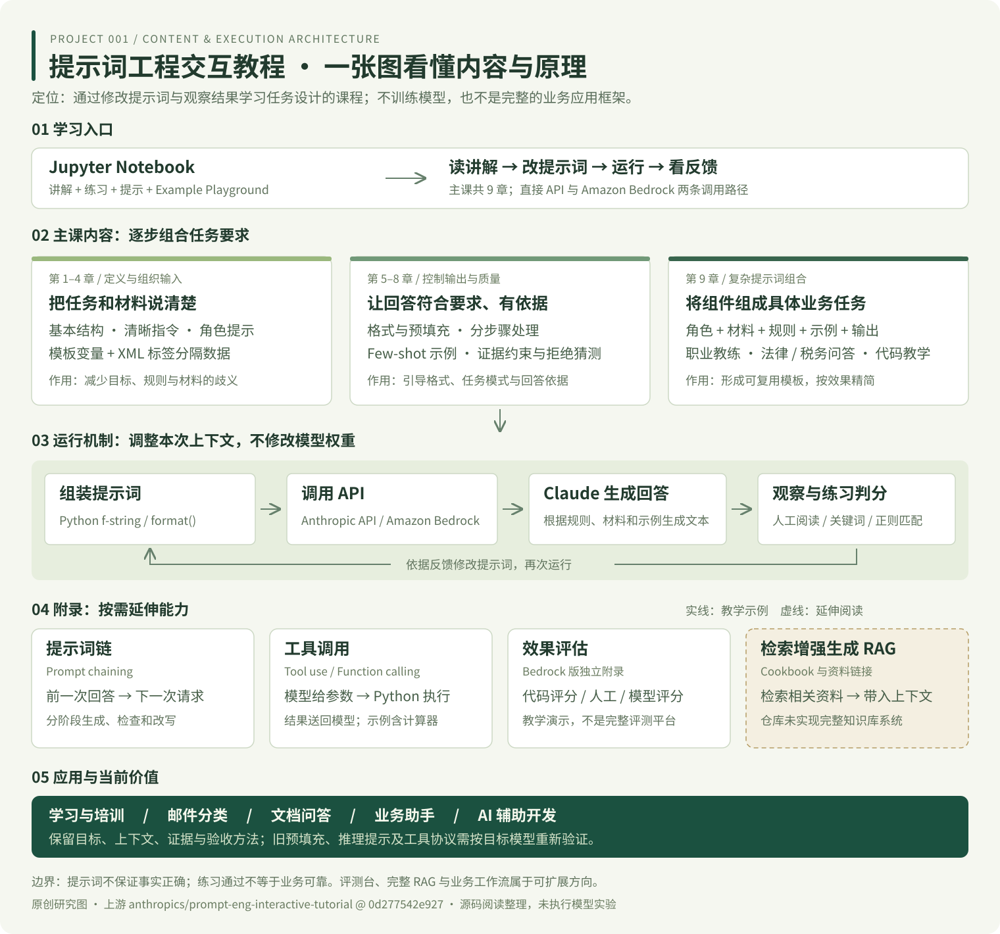
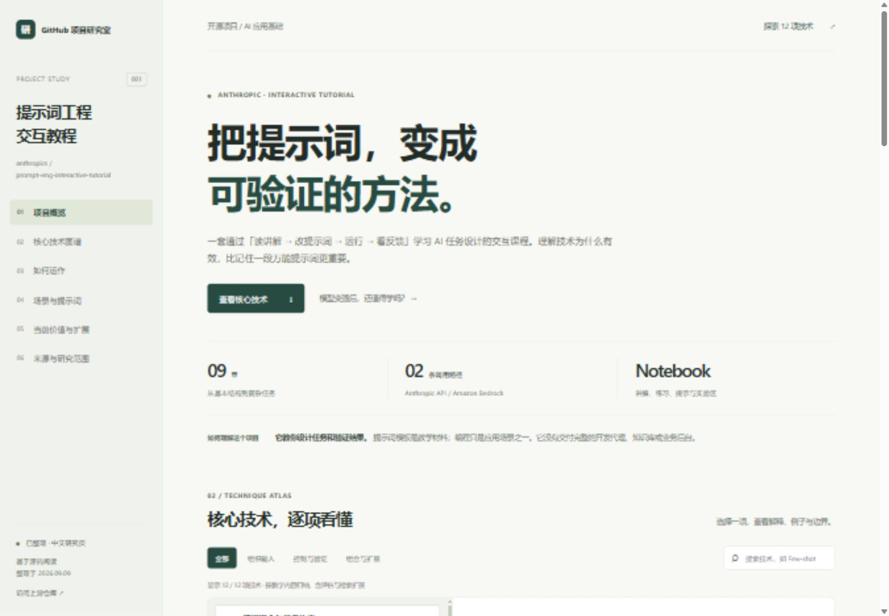

# 001 · 提示词工程交互教程

> Anthropic 官方交互式提示词课程：通过 9 章 Notebook 学习任务定义、示例、格式与证据约束，并用调用反馈迭代；附录介绍提示词链、工具调用、评估和检索扩展。

| 项目资料 | 内容 |
| --- | --- |
| 上游仓库 | [原项目](https://github.com/anthropics/prompt-eng-interactive-tutorial) |
| 研究状态 | 已整理：完成源码阅读和展示，未执行上游模型实验 |
| 研究版本 / Commit | [`0d277542e927652da25b0014c9b346723af55881`](https://github.com/anthropics/prompt-eng-interactive-tutorial/commit/0d277542e927652da25b0014c9b346723af55881)，提交于 2024-04-08 |
| 上游许可证 | 根目录未发现统一 LICENSE；AmazonBedrock 子目录为 MIT No Attribution，不能推定覆盖整个仓库 |
| 收录日期 | 2026-09-09 |

[← 返回总索引](../../README.md) · [展示页源文件](web/index.html) · [来源清单](notes/sources.md)

## 项目摘要

这是一个以 Jupyter Notebook 为载体的交互式提示词工程课程。学习者阅读说明、修改提示词、调用 Claude，观察输出并完成练习。它教人设计任务和验证结果，编程只是应用场景之一，还包括分类、写作、文档问答和业务助手。

主课有 9 章；附录涉及提示词链、工具调用、检索扩展阅读。Amazon Bedrock 版本还提供独立的效果评估教学。它不是完整的开发代理、知识库系统或业务后台。本研究将内容归纳为 **12 项技术**，此数字是整理口径，不是上游章节数。

## 整体架构图



[打开矢量原图，可放大阅读](web/assets/architecture.svg)。图由本研究项目原创绘制，按“学习入口 → 主课内容 → 运行机制 → 附录扩展 → 应用与当前价值”组织；箭头展示主调用和迭代回路，附录为按需使用的教学内容。RAG 虚线框表示延伸阅读，区别于已有可运行示例。

这张图同时用于最外层 README 的项目速览和网页展示，统一维护于 `web/assets/architecture.svg`。章节依据见[来源清单](notes/sources.md)。

## 图片与演示



上图为本子项目展示页的实际浏览器截图，不是上游 Notebook 界面。页面使用本地 HTML、CSS 和 JavaScript，无外部前端依赖。

- 技术图谱：按类型筛选，支持中英文搜索；查看技术解释、原理、原创例子、适用边界和固定版本源码链接。
- 场景演示：邮件分类、文档问答、AI 辅助开发；切换材料、约束、示例与验收要求，复制组合后的提示词。
- 价值判断：区分仍值得掌握的方法与需要重新验证的旧技巧。

演示只组合文本，不调用模型、不生成模拟的 AI 答案、不要求 API 密钥。清单中的 Web 入口按 Pages 规则生成，启用展示不代表已经上线。

<a id="core-techniques"></a>

## 核心技术：名称、原理与简单解释

| 技术 | 简单解释 | 示例与边界 |
| --- | --- | --- |
| 清晰指令与任务约束 | 写明目标、范围、条件和完成标准，减少模型猜测 | “整理 3 条行动项，含负责人和期限；缺失项写未说明”；不能补出缺失事实 |
| 角色提示 Role prompting | 指定视角、受众和表达方式 | “面向 Python 初学者解释错误”；专家头衔不保证专业准确性 |
| 模板变量与数据分隔 | 固定规则写成模板，变量填入材料，用 XML 标签标出边界 | `改写 <email>{正文}</email>`；分隔符不是安全隔离机制 |
| 少样本提示 Few-shot | 在当前上下文里放入少量输入与标准答案，帮助模型归纳任务模式 | “商品有裂痕 → 售后”；示例需正确、有代表性，不会永久训练模型 |
| 输出格式与预填充 | 要求 JSON、XML 或固定标签；原教程还用 assistant 前缀引导续写 | “输出 category、evidence”；提示词不是格式强校验，部分新模型不支持预填充 |
| 分步骤处理 | 给出处理顺序，中间结果成为后续生成的上下文 | 提取限制 → 核对方案 → 给结论；步骤也会出错，现代推理机制需单独核对 |
| 证据约束与拒绝猜测 | 先找原文，再依据材料作答，允许回答资料不足 | “引用退款条款；没有到账时间就明确说明”；引用仍需核验 |
| 复杂提示词组合 | 用变量和文本拼接组合角色、材料、规则、示例与输出要求 | 代码导师 + 代码材料 + 修改规则 + 验证要求；组件并非越多越好 |
| 提示词链 Prompt chaining | 程序将前一次回答送入下一次调用，分阶段处理任务 | 草稿 → 检查 → 修改；增加费用与延迟，自检也可能引入错误 |
| 工具调用 Tool use | 模型提出函数名和参数，程序执行后把结果送回模型 | 计算器、字典模拟数据库；实际执行发生在 Python，生产使用需更新协议与校验 |
| 效果评估 | 用代码核对客观结果，用人工或模型按标准评分 | 标签正确率、格式解析、摘要事实一致性；关键词命中不代表语义正确 |
| 检索增强生成 RAG | 检索外部相关材料，再带入模型上下文生成回答 | 本仓库主要提供延伸阅读，未实现完整 RAG；向量数据库只是可选实现 |

章节与技术对应关系见[来源清单](notes/sources.md)。图谱为每项技术提供更详细解释与例子。

## 核心实现与数据流

整体调用与反馈关系见上方架构图的第 03 层：组装提示词 → 调用 API → Claude 生成回答 → 观察与练习判分 → 修改后再运行。

基础 `get_completion()` 封装 `client.messages.create()`，传入模型名、system 提示词和 messages；基础示例设置 `temperature=0.0`、`max_tokens=2000`。模板替换使用 f-string / format。提示词工程调整推理时的上下文，不修改模型权重；低温度减少输出变化，不保证事实正确。

部分 `grade_exercise()` 仅检查关键词、正则或标签。Bedrock 的评估附录进一步介绍代码评分、人工评分和模型评分。练习通过只说明满足对应检查条件，不能替代真实业务质量评估。

工具示例：描述工具 → 模型生成 `<function_calls>` → `stop_sequences` 截停 → Python 解析参数并执行 → 将 `<function_results>` 送回模型 → 模型组织最终回答。它展示原理，不能直接当作现代生产工具框架。

## 使用场景与需要补充的能力

| 场景 | 课程能帮助什么 | 实际落地还需要 |
| --- | --- | --- |
| 个人学习 / 团队培训 | 讲解、练习、提示与实验区 | 中文业务案例、合适的模型配置 |
| 邮件或工单分类 | 标签规则、Few-shot、固定格式 | 真实标注集、边界情况处理、输出校验 |
| 文档问答与提取 | 资料分隔、证据约束、拒绝猜测 | 文档接入、检索与引用核验 |
| 客服或业务助手 | 角色、业务范围、复杂提示词 | 会话管理和业务系统连接 |
| AI 辅助开发 | 项目上下文、任务约束、验收要求 | 仓库访问、实际执行工具和测试反馈 |

上游第 9 章包含职业教练、法律文档问答、税务信息分析和代码教学。这些是教学案例，不是完整行业产品。网页的三组可切换提示词由本项目原创编写，未声称经过模型实测。

## 模型提升后的价值与可扩展方向

**仍值得掌握：** 明确目标、提供上下文、用代表性示例表达要求、依据资料回答、定义验收标准并使用真实测试集。模型不能知道未提供的业务要求。

**需要重新验证：** 固定措辞、角色装饰、回答预填充及显式逐步推理。教程默认 `claude-3-haiku-20240307`，依赖配置较早。当前官方文档说明部分较新模型不支持末轮预填充；现代推理机制也不能用旧教程“只有输出思考文字才算思考”的说法概括。参见[当前提示词指南](https://platform.claude.com/docs/en/build-with-claude/prompt-engineering/claude-prompting-best-practices)与[扩展思考文档](https://platform.claude.com/docs/en/docs/build-with-claude/extended-thinking)。

以下为研究建议，并非上游现成功能，也未进行跨模型效果验证：

1. **提示词评测台（建议优先）：** 模板版本、真实测试集、独立验证集、批量评分，记录准确率、格式合格率、无依据回答比例、耗时和费用。
2. **企业知识库问答：** 文档解析、检索、重排、来源引用与校验；RAG 的核心是将相关材料带入回答上下文。
3. **业务工具工作流：** 接入真实 API，适配工具协议，增加参数校验、权限和错误处理，由编排控制步骤间的数据传递。
4. **多模型中文教学平台：** 用适配层接入不同模型，以统一任务和评分规则比较表现，提供中文交互练习。

## 运行与复现

### 本研究展示页

需要 Python 3.10 或更新版本，无第三方依赖。在总仓库根目录执行：

```sh
python scripts/catalog.py check
python scripts/catalog.py build
python -m http.server 8000 --directory _site
```

访问 `http://localhost:8000/projects/001-prompt-eng-interactive-tutorial/`。修改 `web/` 后重新构建；不要手写 `_site/`。也可直接打开 `web/index.html`，自动复制取决于浏览器权限，失败时会选中文本供手动复制。

### 上游课程

直接 API 路径见 `Anthropic 1P/00_Tutorial_How-To.ipynb`；AWS 路径见 `AmazonBedrock/`。实际运行需要对应账号、访问权限、模型配置和凭据。先核对当前 SDK、消息格式与模型支持情况，再按上游教程启动，不能只替换模型名。

本次未配置凭据、未执行付费模型调用。“已整理”表示阅读与展示完成，不表示所有上游 Notebook 均已在当前环境跑通。

## 验证与维护

验证覆盖总仓库检查与构建、已有单元测试、浏览器交互和宽窄屏布局。具体结果见 [verification.md](notes/verification.md)。技术内容在 `web/app.js`，结构在 `web/index.html`，样式在 `web/style.css`。变更研究状态时同步 `registry/projects.json`。

## 来源与参考

- [上游仓库](https://github.com/anthropics/prompt-eng-interactive-tutorial)
- [章节与结论对应、研究范围与许可说明](notes/sources.md)
- 本页使用原创摘要、示例和本地展示截图，未复制整套课程或上游素材。
