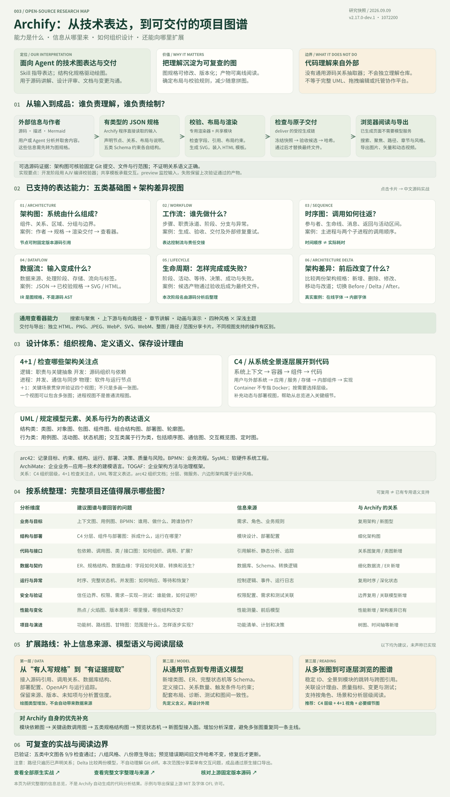
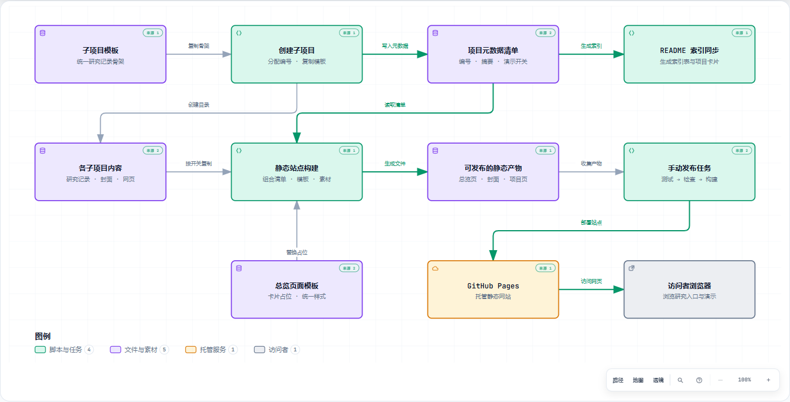

# 003 · Archify 能力与设计图谱

> 把系统描述或代码理解转成可交互的架构图、工作流、时序图、数据流和生命周期图；先看真实产物，再理解实现原理。

[打开一页理解全景](web/index.html) · [公开网页](https://yydshly.github.io/0909_codex_project/projects/003-archify/) · [完整文字整理](web/research.html) · [原始能力展厅](web/examples.html) · [上游仓库](https://github.com/tt-a1i/archify)

## 对外总览：能力、原理、设计体系与扩展



[下载高清 PNG](web/assets/understanding.png) · [下载 SVG 矢量图](web/assets/understanding.svg)

总览以一张图整合定位与目标、外部信息到图规格的生成链、五类图和架构差异、查看器与交付能力、UML / 4+1 / C4 / arc42 等设计体系、八个系统分析维度以及三层扩展路线。已实现、可复用和建议新增明确区分，六张能力卡可跳转真实源码实战。

这是本次研究整理的信息图，原生技术图仍由 Archify 生成。桌面和手机可缩放阅读，也有独立文字版。总览的文字边界与重叠检查、三种屏宽、缩放和 55 个本地资源检查通过。[验证记录](web/receipts/overview-browser.json)

复现总览：`python projects/003-archify/scripts/build-overview.py`。准备 Playwright / Chrome 并启动下文静态服务后，运行 `node projects/003-archify/scripts/verify-overview.cjs` 可重新生成高清图、预览与检查记录。

## 最新：用 Archify 看懂 Archify

[打开完整中文实战](web/self.html) · [分析版本与来源](web/receipts/self-provenance.json)

以 Archify 自身源码为目标，覆盖五类图与真实架构差异：

| 类型 | 本次真实主题 |
| --- | --- |
| 架构图 | 外部作者、规格、加载校验、专用渲染器、交付与查看器 |
| 工作流 | deliver 的职责交接、成功交付与外部修复重试 |
| 时序图 | 主进程、渲染子进程、检查子进程与文件系统的往返 |
| 数据流 | JSON → 快照 → 已校验规格 → HTML，以及证据、回执与导出 |
| 生命周期 | 候选产物的正常阶段、提交前失败与旧产物保留 |
| 架构差异 | 相邻提交 b86b607 → 1072200 的在线字体改为内嵌字体 |

另外提供四种风格 × 深浅主题的八组原生截图；PNG、JPEG、WebP、SVG、WebM 与整图 / 路径 / 范围三种分享卡片；以及真实预览服务“有效输入 → 损坏 JSON → 修复”的记录。

五张技术图均通过原生 9 项产物检查与 showcase 构图校验。差异比较器核验两个固定提交。浏览器实测导出文件签名与哈希、源码链接、下游追踪；预览实验断言失败期间旧文件哈希及版本不变，修复后才变化。[浏览器与导出记录](web/receipts/self-browser.json) · [预览实验记录](web/receipts/self-preview.json)

**实测限制：** 该版本工具栏操作会清除当前聚焦，键盘确认也未能完成范围分享；本次媒体由原生 `Archify.exportMenu` 方法生成，没有修改上游实现。源码关系由本次阅读后编写，不是库自动抽取；五类技术图也不等于 UML 全家族。差异比较的是按实际代码编写的两个模型，均由当前版本渲染。中文使用系统字体回退。

复现：`node projects/003-archify/scripts/build-self.mjs` 生成图；`node projects/003-archify/scripts/verify-self-preview.mjs` 运行预览实验。启动本地展厅服务、准备 Playwright / Chrome 后运行 `node projects/003-archify/scripts/verify-self.cjs` 生成截图与原生导出。构建脚本使用上文固定 HEAD，并需要本地可读取其父提交。



*本图由 Agent 阅读 0909_codex_project 源码后编写图规格，再由真实 Archify 渲染器生成；11 个节点、11 条关系、14 处源码引用。*

## 新增：拿本仓库做真实演示

[打开中文交互图](web/diagrams/repository.html) · [阅读分析与证据对应表](web/repository-notes.html) · [本次图规格](web/specs/repository.json) · [带源码核验的交付记录](web/receipts/repository.json)

分析对象是当前研究总仓库 **0909_codex_project**。按实际源码，整理出三部分：

1. **收录与索引**：`create_project` 复制模板、分配编号、登记清单；`sync` 更新 README 索引和卡片。
2. **静态站点构建**：`build` 组合清单、封面、总览模板和启用的项目网页，写入 `_site/`。
3. **手动发布**：Pages 工作流先测试、检查、构建，再上传与部署；普通 push / PR 只运行检查。

本次明确区分了分工：**Agent 从代码整理事实并编写 JSON；Archify 校验规格和源码定位、计算布局、渲染与交付。** 这不是 Archify 独立自动解析代码。图中箭头表示输入输出和数据流，不是完整调用时序。发布工作流会在 CI 中重新构建。

机制源码固定在 `855cde37272f0ab9912cfe8595ee0060ad531c9a`；核对时工作区中的 `catalog.py`、项目模板和两份工作流与该提交一致。图不写死持续变化的项目数量。

**验证结果：** 9/9 showcase 检查通过，0 错误、0 警告；14 处来源已通过 Git 校验。上游 `visual-check` 的四视口检查通过，并已目视检查两端尺寸的深浅主题截图。浏览器验证了“静态站点构建”定位到 `catalog.py#L133-L168`，及构建节点到产物、发布任务、Pages、浏览器的下游追踪。

[四视口检查与截图](web/diagrams/repository.visual-check.html) · [机器记录](web/diagrams/repository.visual-check.json) · [交互验证记录](web/receipts/repository-interactions.json) · [来源详情截图](web/assets/repository-source.png)

复现本案例（在总仓库根目录，使用已准备的固定版本 Archify）：

```sh
node projects/003-archify/scripts/build-repository.mjs
node .research/archify/archify/bin/archify.mjs visual-check projects/003-archify/web/diagrams/repository.html --json
```

启动下文的本地服务并准备 Playwright / Chrome 后，可运行 `node projects/003-archify/scripts/verify-repository.cjs` 重做交互检查和预览截图。

## 先看它能做什么

**Archify 用不同类型的图回答不同的系统问题，并把结果交付成可以直接打开的独立 HTML。** 展厅提供一个本仓库中文实战、六个上游能力示例、原生查看器、图规格和检查记录。桌面可直接操作；窄屏显示完整预览，并提供独立交互图入口。

| 想回答的问题 | 能力与真实示例 | 直接打开 |
| --- | --- | --- |
| 系统由什么组成？ | 架构图：入口、认证、API、Redis、PostgreSQL、队列与 Worker | [Web 应用架构](web/diagrams/architecture.html) |
| 谁先做，谁后做？ | 工作流：用户、Agent、审批、工具执行、证据回传分泳道展示 | [Agent 工具调用](web/diagrams/workflow.html) |
| 一次请求怎样往返？ | 时序图：认证、缓存未命中、数据库回退、返回与异步追踪 | [缓存回退请求](web/diagrams/sequence.html) |
| 数据流向哪里？ | 数据流：采集、事件流、敏感数据隔离、仓库、看板与模型 | [产品分析数据流](web/diagrams/dataflow.html) |
| 任务如何走到结束？ | 生命周期：排队、规划、执行、完成，以及等待、恢复与终止 | [Agent 生命周期](web/diagrams/lifecycle.html) |
| 这次改造改变了什么？ | 架构差异：切换 Before / Delta / After，查看具体变更 | [结算平台架构改造](web/diagrams/delta.html) |

### 图生成以后

- **交互阅读**：搜索和聚焦节点、查看上下游、查询已声明关系中的最短有向路径。
- **演示讲解**：按预设章节聚焦不同主线，按需播放有限动画。
- **视觉与导出**：四种视觉预设、深浅主题，SVG、PNG、JPEG、WebP、分享卡片与 WebM 导出入口。
- **可复查产物**：保留 JSON 图规格、校验与交付记录，以及输入和产物摘要。
- **可选源码关联**：架构图可关联固定 Git 提交中的文件与行范围；已在“本仓库实战”中启用，其余六个上游样例未启用。

**建议体验顺序：** 架构图点选 `API Server` → 时序图切换 `Cache fallback` 章节 → 数据流追踪 `Warehouse` → 查看架构差异 → 在普通图工具栏导出 PNG。

## 它是怎样工作的

```text
系统描述 / 由 Agent 阅读的代码 / Mermaid 输入
              ↓
Agent 选择图型、组件、主线与布局意图
              ↓
有类型约束的 JSON 图规格
              ↓
结构校验 → 专用布局与渲染 → 构图检查
              ↓
检查通过后原子替换 HTML，保留输入与产物摘要
              ↓
浏览器交互、导出与版本对比
```

AI 负责理解和取舍，程序负责可重复的渲染与检查。工作流 v2 会根据节点和标签测量结果计算列宽与路径，并非所有像素坐标都由 AI 手算。Mermaid 由 Agent 理解后转写成 JSON，当前不是自动 Mermaid 解析器。

与 [Lieflat Charts 研究](https://yydshly.github.io/0902_codex_project/demos/002-larashero3-dotcom-lieflat-charts/) 的关系：两者都把可视化经验交给 Agent 执行；Lieflat Charts 侧重数据图表与报告，Archify 侧重系统关系，并提供专用图规格、渲染器和机器校验。

## 研究与验证

| 项目资料 | 内容 |
| --- | --- |
| 上游仓库 | [tt-a1i/archify](https://github.com/tt-a1i/archify) |
| 研究状态 | 已整理：能力展示阶段 |
| 研究版本 | `2.17.0-dev.1`，开发版本 |
| 固定提交 | [`10722002bb8777ecb639d93c49586fae4adf3ae4`](https://github.com/tt-a1i/archify/tree/10722002bb8777ecb639d93c49586fae4adf3ae4) |
| 上游许可 | [MIT 原文](web/LICENSE-Archify.txt)，字体与其他素材另见[第三方声明](web/THIRD-PARTY-NOTICES.md) |
| 整理日期 | 2026-09-09 |
| 发布状态 | 本地已完成，待提交与站点发布 |

保留上游示例的节点、关系、布局和英文内容，仅将五类图页面标题和固定查看器 UI 设为中文，并设为默认静态。架构对比沿用上游英文标题与控件。所有图均由固定提交的真实渲染器生成。

| 检查 | 本次结果 | 证据 |
| --- | --- | --- |
| 五类图生成与交付 | 每类 9/9 showcase 检查通过，0 错误、0 警告 | [生成记录目录](web/receipts/) |
| 架构比较 | `ok: true`，完整的 authored 图规格差异 | [差异记录](web/receipts/delta.json) |
| 六个真实 HTML | 浏览器均载入并显示 SVG，未捕获脚本错误 | [浏览器记录](web/receipts/browser.json) |
| 查看器操作 | 主题切换、搜索、PNG 下载成功；验证 PNG 签名和 4320×2352 尺寸 | [浏览器记录](web/receipts/browser.json) |
| 展厅导航 | 六场景切换、键盘切换、原图与规格链接、深链接传递通过 | [浏览器记录](web/receipts/browser.json) |
| 响应式外壳 | 390、768、1440 宽度无横向溢出；小屏用完整图预览 | [手机截图](web/assets/showcase-mobile.png) |
| 视觉复核 | 已查看桌面与手机展厅、五类图及差异图截图 | [桌面展厅](web/assets/showcase-desktop.png) |

上表记录最初六个上游示例的有限浏览器检查，**不冒充上游 `visual-check` 的四视口验收记录**；新增本仓库实战已单独执行该四视口检查，见上文。五类独立图在 1440×1000 内完整显示；差异页内容更长，可正常纵向滚动。未逐一验证所有风格、快捷键、WebM 和剪贴板导出，也未验证任意新输入的生成成功率。

## 本地查看与复现

直接打开 `web/index.html` 即可查看；若浏览器限制本地文件功能，可在总仓库根目录运行：

```sh
python -m http.server 8763 --bind 127.0.0.1 --directory projects/003-archify/web
```

然后打开 `http://127.0.0.1:8763/`。无需 API Key 或在线模型，展厅提供已经生成的交互产物。

重建示例需要固定提交的上游检出目录：

```sh
git clone https://github.com/tt-a1i/archify.git .research/archify
git -C .research/archify checkout 10722002bb8777ecb639d93c49586fae4adf3ae4
node projects/003-archify/scripts/build-examples.mjs .research/archify
```

已有目录时无需再次 clone。脚本需要 Node.js 18+ 和 Git，运行真实 `deliver` 与 `compare`，保留规格、检查记录、摘要和许可证。它不安装 Skill，也不调用更新检查或模型服务。

浏览器复验与截图需要可解析的 `playwright` 包和 Chrome，先启动上述本地服务，再运行：

```sh
node projects/003-archify/scripts/verify.cjs
```

可通过 `ARCHIFY_DEMO_URL` 改测试地址，通过 `ARCHIFY_BROWSER_CHANNEL` 选择浏览器通道。最后运行总仓库 `scripts/catalog.py sync`、`check` 和 `build` 接入静态站点。

## 能力边界与下一阶段

图校验不证明真实系统已完整验证；源码定位有效也不等于所有架构判断都有充分语义证据。上下游追踪只遍历图中已声明的关系，不能直接解释成故障影响范围。该库当前面向生成与查看，未提供通用拖拽编辑、生产环境自动发现或托管协作平台。

本阶段已完成原始能力展示、研究仓库架构案例、Archify 自身五类中文图、真实字体变更差异和对外理解总览。下一层重点是模块依赖、关键函数调用、规格结构、预览状态机和新图型接入分析；这些仍属于扩展建议。

## 来源与素材

- 原始示例：[固定提交下的 archify/examples](https://github.com/tt-a1i/archify/tree/10722002bb8777ecb639d93c49586fae4adf3ae4/archify/examples)。
- 核心实现：[图规格](https://github.com/tt-a1i/archify/tree/10722002bb8777ecb639d93c49586fae4adf3ae4/archify/schemas)、[渲染器](https://github.com/tt-a1i/archify/tree/10722002bb8777ecb639d93c49586fae4adf3ae4/archify/renderers)、[架构差异](https://github.com/tt-a1i/archify/blob/10722002bb8777ecb639d93c49586fae4adf3ae4/archify/delta/architecture-delta.mjs)。
- 图规格副本及生成 HTML 沿用 Archify MIT 许可，保留 tt-a1i 和 Cocoon AI 版权说明；截图由本研究在本地采集。
- 内嵌字体另保留 [JetBrains Mono OFL](web/JetBrainsMono-OFL.txt)。
- [产物版本与 SHA-256 清单](web/receipts/manifest.json)。
