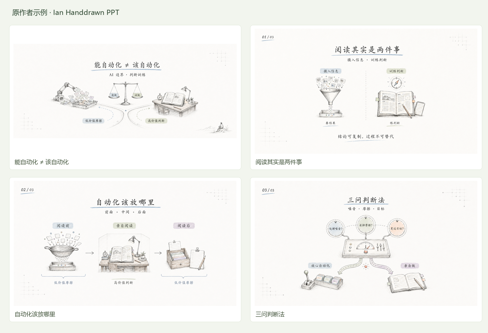
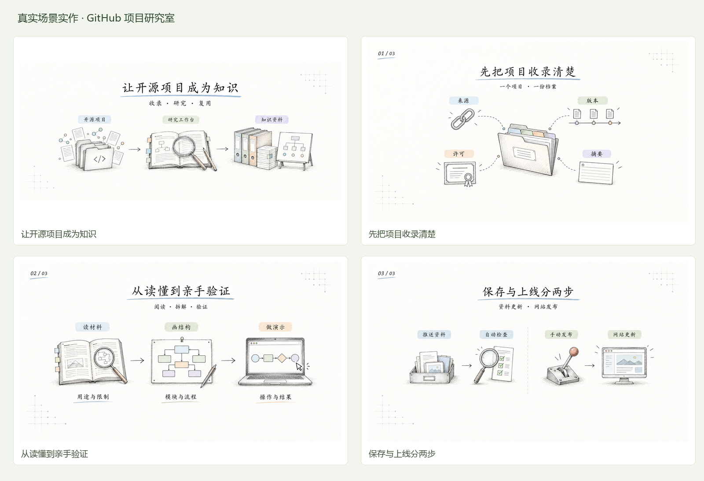

# 004 · 中文手绘解释图展厅

输入想法、文章或观点，AI 按库的规则梳理内容与讲述顺序，再生成一套思路连贯、风格统一的演示页面图片。先用整体引导图理解能力，再看原作者示例和本研究室的真实场景实作。

| 项目资料 | 内容 |
| --- | --- |
| 上游仓库 | [helloianneo/ian-handdrawn-ppt](https://github.com/helloianneo/ian-handdrawn-ppt) |
| 研究状态 | 已整理 |
| 固定研究版本 | `b2cc5f303337e5470fd6ac2870d261a43b218439` |
| 上游许可 | MIT，Copyright 2026 Ian；保留署名与 NOTICE |
| 收录日期 | 2026-09-09 |
| 本次交付 | 静态效果展厅、8 张页面 PNG、2 张缩略总览、素材、规划与提示词 |

[← 返回研究室](../../README.md) · [打开静态展示页](web/index.html) · [完整逐页规划](web/data/blueprint.json)

## 整体引导图


**内容输入 → 提炼观点 → 编排思路 → 设计页面 → 生图与检查 → 一套演示图。**

原库提供指导 AI 工作的规则，默认采用中文手绘风格。最终交付整页 PNG、多页总览和规划摘要；可单独做规划。可编辑 PPTX 或其他风格需要额外实现与验证。

[完整理解与能力边界](notes/library-understanding.md) · [引导图原图](assets/library-guide-v1.png)

## 先看原库效果

原作者示例主题为自动化的边界，包括封面、阅读的两种目标、自动化的适用位置与三问判断法。



4 张 PNG 来自上游固定提交中的 `examples/images/`，原文件未修改；校验 Git blob 哈希确认一致。缩略总览由本展厅额外制作，不是原作者提供的页面。

## 再看真实场景实作

**场景：给本研究室的新协作者，介绍怎样把一个开源项目整理成可复用的知识。**

材料来自本仓库的 README、项目收录约定和部署指南。面向新协作者的教学用途为本次合理设定；工作流程本身来自实际文档。没有编造客户故事、运行指标或收益数据。



| 页面 | 主要观点 | 版式 |
| --- | --- | --- |
| 封面：让开源项目成为知识 | 原始项目通过研究整理成为知识资料 | 封面隐喻 |
| 01：先把项目收录清楚 | 档案包含来源、版本、许可和摘要 | 分类图 |
| 02：从读懂到亲手验证 | 阅读材料、理解结构、通过演示验证 | 三站流程 |
| 03：保存与上线分两步 | 资料推送触发检查，网站发布仍需手动操作 | 阶段区分 |

本次按上游 Skill 的内容规划、语义版式、风格锁和文字限制执行，使用内置 `image_gen` 工具，附上原库参考图，逐页生成。图片中的中文字与插图一起生成，未用程序排版冒充生图结果。保留原生尺寸，实际大小可在画廊和[制作记录](web/data/verification.json)中查看。

- [场景素材与编排取舍](web/data/source-material.md)
- [每页规划和完整提示词](web/data/blueprint.json)
- [人工与浏览器验证记录](notes/verification.md)

## 这个库展示了什么能力

文章与笔记 → 内容提炼 → 逐页叙事 → 按语义选择布局 → 统一风格 → 图像模型绘制整页 → 检查与返工。

核心是一套 AI 工作规则：`upstream/SKILL.md` 控制流程，`references/` 给出叙事和画面规则，`assets/theme-tokens.json` 定义主题参数，参考 PNG 引导风格。它没有独立生图模型、文件解析器或 PPTX 渲染程序。

适用于文章配图、课程概念讲解、产品工作流程、知识卡片。产物为整页 PNG，文字不可单独编辑；中文准确性和多页风格仍需检查。本展厅只浏览已生成的结果，不提供在线生图，也没有把输出包装成可编辑 PPTX。

## 可扩展方向

### 风格是否只有一种？

原库默认提供一套中文手绘技术解释风格；本页的两组作品使用相同风格，不同的是内容与版式。对比、流程、分类属于版式变化。

可以调整参考图、主题参数和提示词规则探索其他风格，但原库没有内置风格选择器。配色、画幅与边框等变化需要修改规则并重新生成。扁平信息图、蓝图、漫画讲解属于可探索但尚未实作的方向，需同步修改相关视觉规范和排除条件，再验证效果。

网页新增“风格与原理”说明，区分原库默认能力、规则可调整范围及未实现的扩展方向，并展示最终交付、输入素材、页面规划和制作记录入口。

1. 将页面规划稳定保存成结构化数据，本子项目已保存 JSON 作为过程记录。
2. 文字与插图分层，改善准确性、修改与多语言适配；本次未实现分层。
3. OCR 比对必需文字，自动检测尺寸与跨页差异；本次只实现文件、尺寸和原图哈希校验。
4. 增加 PPTX/PDF 导出、批量队列和主题切换；这些均不属于当前展示页的功能。

## 本地查看与复现

直接打开 `web/index.html` 可浏览，所有资源随子项目保存，无需前端依赖或账号。推荐通过本仓库现有静态构建查看：

```sh
python scripts/catalog.py check
python scripts/catalog.py build
python -m http.server 8000 --directory _site
```

本地地址为 `http://localhost:8000/projects/004-ian-handdrawn-ppt/`。这不是已经发布的公网地址。

画廊支持缩略图切换、前后翻页、键盘方向键、放大预览、Esc 关闭、单张 PNG 下载和提示词复制。查看过程区可切换原始材料、页面规划与生成提示词。

如需重新生成页面，读取 `upstream/SKILL.md`，将 `web/data/blueprint.json` 中逐页提示词和 `upstream/assets/reference-handdrawn-article-illustration-style.png` 交给支持参考图的图像工具；将新结果另存为版本文件，检查后再更新展示。

仅重新生成元数据与缩略总览可运行：

```sh
python projects/004-ian-handdrawn-ppt/experiments/build_gallery.py
```

此步骤使用 Pillow，不调用图像模型、不改动原始页面。

## 来源与署名

- [Ian Handdrawn PPT](https://github.com/helloianneo/ian-handdrawn-ppt)，作者 Ian（helloianneo）。
- [固定提交](https://github.com/helloianneo/ian-handdrawn-ppt/tree/b2cc5f303337e5470fd6ac2870d261a43b218439)。
- [MIT License](web/assets/original/LICENSE) 与 [NOTICE](web/assets/original/NOTICE.md)。
- 原库 Skill 与参考图按固定版本保存在 `upstream/`，供复现；原作者示例保存在 `web/assets/original/`。
- 本次新生成图片保存在 `web/assets/scenario/`，展示页和场景编排由本研究室制作，未声称为原作者作品。
