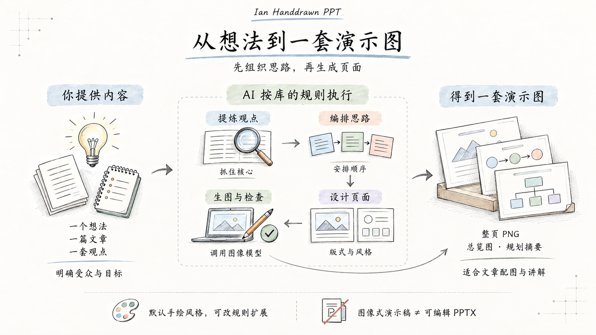

# Ian Handdrawn PPT · 整体理解

状态：已确认整理方向，纳入项目说明与效果展厅。

## 应用层的一句话解释

输入一个想法、一篇文章或一套观点，AI 按这个库提供的工作规则梳理内容、编排讲述顺序，再生成一套思路连贯、风格统一的演示页面图片。

## 沿图理解

1. **你提供内容。** 可以是想法、文章、观点、笔记或已有资料。受众与表达目标会影响编排；只有一个模糊想法时，可能还需要补充信息。
2. **先提炼，再编排。** 找出核心观点，确定每页讲什么、按照什么顺序讲，形成完整叙事。
3. **按内容设计页面。** 步骤适合流程，差异适合对比，归类适合分类图。多种版式可以共享一种视觉风格。
4. **调用图像模型生成并检查。** AI 按统一的视觉规则逐页生成，通常将标题、标签和插图直接画进图片，并检查中文与逻辑关系。
5. **交付一套演示图。** 输出整页 PNG、多页缩略总览与简短规划摘要；也可以只做规划而不生图。

## 已明确的能力边界

- **从用途看，是图像式演示稿。** 内容顺序和页面视觉已经具备 PPT 的讲述方式，适合课程讲解、技术分享、文章配图。
- **从文件看，目前是图片。** 原库不直接导出可编辑 PPTX。额外增加组装步骤，可以把图片放进可放映的 PPT 文件，但图片里的文字和图形仍不能单独编辑。
- **从风格看，默认是一套中文手绘规则。** 更换参考图、主题与视觉约束可以探索其他风格；这需要修改并验证，不是原库现成的多风格切换功能。
- **从技术看，是 AI 工作方法。** 库提供叙事、版式、提示词、参考风格和质量检查规则；真正执行依赖 AI 与图像工具，库没有附带独立生图模型。

## 本图的定位

这是一张“如何理解这个库”的整体引导图，用于在看效果前建立全貌。它概括工作流程，不替代每一项执行细则，也不声称任何输入都能无需补充地自动产生正确成品。

图中将实际执行步骤合并成“提炼观点 → 编排思路 → 设计页面 → 生图与检查”四步，便于非技术读者阅读。默认使用原库手绘参考风格。

## 来源与制作

- 基于已经核对的原库固定提交 `b2cc5f303337e5470fd6ac2870d261a43b218439`。
- [主流程](../upstream/SKILL.md)、[叙事规则](../upstream/references/narrative-planning.md)、[交付与检查](../upstream/references/output-quality.md)。
- 风格参考：Ian 的原库参考图片；[署名说明](../upstream/NOTICE.md)。
- 本图使用内置 image_gen 工具生成；[完整提示词](library-guide-v1-prompt.txt)。
- 引导图已纳入展厅与项目入口；原始生图文件保存在 assets，网页副本保存在 web/assets。
- 本次实际图片尺寸为 1672×941，保留生图原文件。已目视检查主要中文、四步顺序、输入输出关系和两条能力边界；PNG 解码校验通过。
