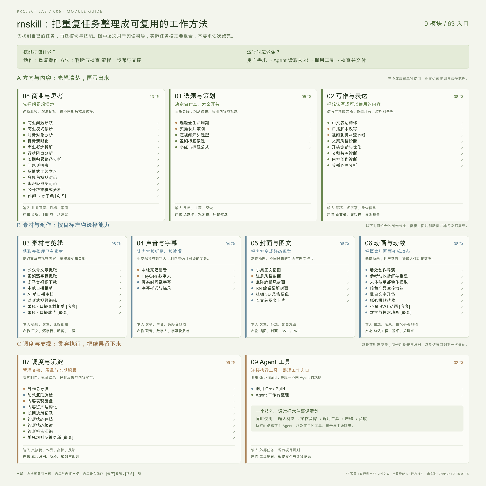

# 006 · rnskill 个人能力工作台

rnskill 是以个人内容生产为主的 Agent 技能集合，覆盖选题、写作、素材处理、配音字幕、视觉动画、制作管理与商业诊断。它用 `SKILL.md` 保存工作方法和判断规则，由宿主 Agent 按任务调用脚本、工具与外部服务，并通过文件交接和质检衔接步骤。适用于个人自媒体、课程教程、产品演示和内容资产管理；完整复用需要适配个人工作台及服务配置。

我们的理解是：它把个人经验整理成 AI 可以遵循的工作能力，其中既有可重复的单个动作，也有需要判断的方法和跨工具的多步流程。例如，提取文章是动作，评审开头是判断，脚本到配音、字幕和成片则是流程。能力的执行依赖宿主 Agent 和相应工具环境。

| 项目资料 | 内容 |
| --- | --- |
| 上游仓库 | [Pluviobyte/rnskill](https://github.com/Pluviobyte/rnskill) |
| 作者 | 雪踏乌云；仓库还收录或改编了其他作者的技能 |
| 研究版本 | `7cbf47b57cbae0596d46c10c4a1445cbb27904b3` |
| 核对日期 | 2026-09-09 |
| 状态 | 已整理（能力、原理、场景与全能力模块引导图） |
| 方法 | 固定提交文件树、全部技能入口定义、代表性脚本的静态核对 |
| 运行范围 | 仅验证本子项目展示页面；未安装、执行上游技能或调用收费服务 |
| 上游许可 | 默认 CC BY-NC 4.0；第三方模块保留自身许可 |

[← 返回研究室](../../README.md) · [打开展示页面](web/index.html) · [完整能力清单](notes/capability-catalog.md) · [机器可读清单](web/data/catalog.json)

## 能力总览

**新增：[全能力模块引导图](web/guide.html)** · [高清 PNG](web/assets/module-guide.png) · [单张 SVG](web/assets/module-guide.svg)

一张图展示全部 63 个技能入口，按三层阅读：**A 方向与内容**（商业思考、选题策划、写作表达）→ **B 素材与制作**（素材剪辑、声音字幕、封面图文、动画动效，按任务选择）→ **C 调度与支撑**（交接、质检、复盘、资产与 Agent 工具，贯穿全程）。每个模块介绍用途、输入和产物；点击技能名称可查看完整说明。图中的层次为研究整理的阅读顺序，不代表所有模块必须依次执行。



上图为本研究原创示意图，展示整理后的分类；不代表上游软件运行截图。

| 类别 | 技能入口 | 主要用途 |
| --- | ---: | --- |
| 选题与策划 | 5 | 灵感记录、实操策划、开头选型、视频与图文标题 |
| 写作与表达 | 8 | 表达精修、脚本改写、开头与共鸣诊断 |
| 素材与剪辑 | 8 | 文章提取、视频下载、转写、口播粗剪与成片 |
| 声音与字幕 | 4 | 克隆配音、数字人、字幕对齐与样式烧录 |
| 封面与图文 | 6 | 手绘配图、系列封面、风格图像、长文转卡片 |
| 动画与动效 | 8 | 动效导演、参考重建、人体轨迹、产品与数学动画 |
| 调度与沉淀 | 9 | 制作交接、质检、复盘、内容资产、状态保存 |
| 商业与思考 | 13 | 商业诊断、目标澄清、对标、问题拆解和模拟讨论 |
| Agent 工具 | 2 | Grok Build 调用、宿主工作台规则整理 |
| **合计** | **63** | **技能文件入口，非互不重复的能力数** |

统计口径：58 个顶层 `SKILL.md` + 5 个嵌套 `SKILL.md`。其中「孙割」只是「孙宇晨」的别名。README 中的 57 与文件树口径不同；本页保留所有实际文件入口，明确标记嵌套与别名。乘风包没有顶层 `SKILL.md`，其 4 个嵌套技能分别展示；video-use 内另有 1 个 Manim 技能。

## 页面如何使用

- 按左侧九类能力筛选，或搜索中文名称、原技能名、输入、产物和依赖。
- 按复用条件或入口类型组合筛选；无结果时可一键清除。
- 打开能力详情，查看输入输出、准备条件、实现线索和固定版本的原始技能链接。
- 默认展示 12 个代表入口，点击“查看更多”逐步展开，全部 63 个均可浏览。
- 查看文章到图文、脚本到视频、口播粗剪、数据复盘四条典型路径；节点可打开对应技能。
- 下载 JSON 能力清单。页面无远程字体、统计或前端依赖，支持本地文件打开和静态托管。

复用分类是研究判断：

| 标记 | 含义 |
| --- | --- |
| 方法可复用 | 主要依赖宿主 Agent、资料和本地文档操作 |
| 需工具配置 | 需要模型、API、CLI、媒体工具或渲染环境 |
| 需工作台适配 | 明显依赖作者目录、模板、声音、注册资产或配套系统 |

这些标记均不代表已经安装或实测成功。展示的商业和文案诊断属于按方法进行的大模型评审。

## 技术原理

1. **技能说明**：`SKILL.md` 定义适用条件、步骤、参考资料和检查规则。
2. **Agent 编排**：宿主理解任务并选择技能，生成内容或选择执行工具。
3. **实际执行**：Python / JavaScript 脚本调用媒体工具、识别模型、生图能力和外部服务。
4. **文件交接**：Markdown、YAML 元数据、JSON / JSONL 保存制作要求、状态、时间轴和结果。

封面采用“生成插图 + 程序排版”；字幕使用最终音频的 ASR 时间戳，再把原稿映射到识别文本；图文使用 HTML/CSS 模板和 Playwright 截图。流程中的文字要求由 Agent 遵循，实际强制校验依赖对应脚本。

## 使用场景

以下是根据技能定义整理的适用任务，实际执行需满足对应模块的准备条件。

| 使用场景 | 能力如何配合 | 预期产物 |
| --- | --- | --- |
| 个人自媒体 | 选题策划、脚本改写、配音字幕、封面与制作交接 | 文稿、图文卡片或视频制作材料 |
| 课程与教程 | 实操策划、表达精修、数学动画、字幕与图文排版 | 教程脚本、演示动画和配套图文 |
| 产品演示 | 产品动效、参考重建、讲解脚本与后期制作 | 产品介绍素材和演示视频 |
| 商业思考 | 目标澄清、对标分析、问题拆解与模拟讨论 | 基于输入资料的分析与决策参考 |
| 内容资产管理 | 素材整理、交接、质检、数据复盘与状态保存 | 可继续加工的素材、制作记录和复盘文档 |

## 已核实的复用边界

当前文件树未包含以下被技能引用的资源：

- `automation/scripts/wash_ledger.py`：内容去重台账。
- `automation/scripts/check_delivery.py`：交付检查。
- `automation/scripts/hot_monitor_local_job.sh`：云端监测读取。
- `automation/config/tts-routing.json`：配音路由与声音配置。

配音脚本还会寻找同时拥有 `CLAUDE.md` 与 `automation/` 的工作台根目录。完整搬用需要补齐环境与个人资产。数字人、ASR 等能力另有账号、服务和运行条件。本研究未据此承诺自动出片、自动发布或增长效果。

## 本子项目的复现

无需安装前端依赖。可以直接打开 `web/index.html`，或在研究室根目录执行：

```sh
python projects/006-rnskill/experiments/collect_inventory.py
python projects/006-rnskill/experiments/build_catalog.py
python projects/006-rnskill/experiments/build_module_guide.py
python scripts/catalog.py sync
python scripts/catalog.py check
python scripts/catalog.py build
python -m http.server 8000 --directory _site
```

访问 `http://localhost:8000/projects/006-rnskill/`。采集脚本仅下载固定提交的文件定义，不执行上游代码；原始文件缓存在根目录 `.research/rnskill/`（不进入版本控制）。人工研究注释在 `notes/capabilities.psv`，构建脚本检查它与上游入口的一一对应关系，并生成网页数据和完整 Markdown 清单。

总索引由 `registry/projects.json` 管理，通过研究室的 GitHub Pages 工作流构建和发布。线上入口：[能力工作台](https://yydshly.github.io/0909_codex_project/projects/006-rnskill/) · [全能力模块引导图](https://yydshly.github.io/0909_codex_project/projects/006-rnskill/guide.html)。发布结果可在仓库的 [Pages 工作流](https://github.com/yydshly/0909_codex_project/actions/workflows/pages.yml) 查看。

## 后续研究方向

- 选择一个低依赖技能实测，记录实际输入、产物、耗时和失败情况。
- 将工作目录、声音、品牌风格与服务参数分离为通用配置。
- 为交接稿和任务状态补充结构校验、重试与断点恢复。
- 接入实际发布指标，区分单次观察与经过验证的规律。

## 来源

[源码证据与研究说明](notes/sources.md) · [验证记录](notes/verification.md)

全部能力详情链接指向固定提交中的原始 `SKILL.md`。本项目以中文归纳整理能力；上游内容的权利和许可归对应作者，第三方来源请查看上游 [CREDITS.md](https://github.com/Pluviobyte/rnskill/blob/7cbf47b57cbae0596d46c10c4a1445cbb27904b3/CREDITS.md)。
