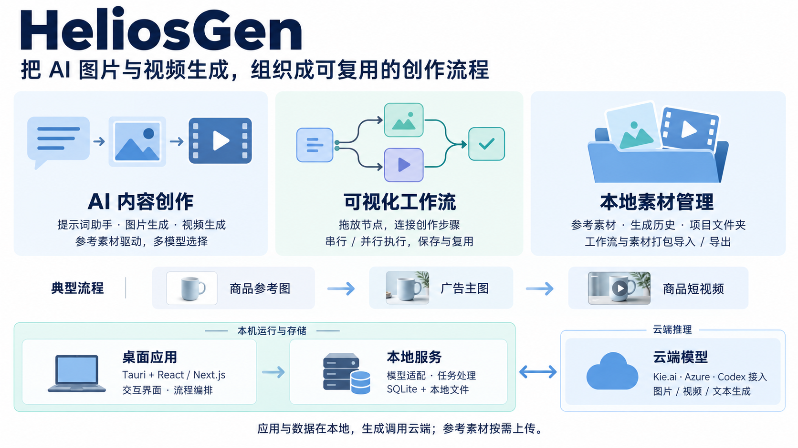

# 007 · HeliosGen AI 创作工作台

**把 AI 图片与视频生成，组织成可复用的创作流程。**

面向图片与视频创作的桌面应用，支持提示词辅助、节点工作流与本地素材管理；通过云端模型 API 适配和依赖调度串联生成任务，减少重复操作、复用创作流程；可扩展更多模型、本地推理、任务恢复、成本控制与行业模板。

[在线概览](https://yydshly.github.io/0909_codex_project/projects/007-heliosgen/) · [上游仓库](https://github.com/SegFault42/HeliosGen) · [查看原图](web/assets/heliosgen-overview.png) · [返回研究室](../../README.md)

## 一图理解

> 本图为本次研究制作的 AI 生成说明图，非上游应用截图。图中以逻辑职责介绍能力，不代表独立微服务。

## 深入阅读网页

网页保留一图速览，并完整整理产品定位、能力清单、业务对象、技术架构、执行机制、应用价值和扩展方向：

- [产品定位与能力边界](https://yydshly.github.io/0909_codex_project/projects/007-heliosgen/#understanding)
- [五个业务对象与职责拆分](https://yydshly.github.io/0909_codex_project/projects/007-heliosgen/#business)
- [详细架构图与逐层解释](https://yydshly.github.io/0909_codex_project/projects/007-heliosgen/#architecture) · [下载 SVG 原图](web/assets/architecture.svg)
- [交互式执行过程与分批调度说明](https://yydshly.github.io/0909_codex_project/projects/007-heliosgen/#execution)
- [场景与价值](https://yydshly.github.io/0909_codex_project/projects/007-heliosgen/#value) · [可扩展方向](https://yydshly.github.io/0909_codex_project/projects/007-heliosgen/#extensions)

架构图支持放大、缩小、适应宽度和下载。执行过程为本地交互示意，不会上传素材或调用模型；禁用 JavaScript 时仍可阅读静态步骤。

## 三大能力

| 模块 | 能做什么 |
| --- | --- |
| AI 内容创作 | 提示词助手、图片和视频生成，按模型使用参考素材与参数 |
| 可视化工作流 | 拖放节点、连接步骤，图片和视频节点按依赖分批执行，保存与复用流程 |
| 本地素材管理 | 管理参考素材、生成历史和文件夹，打包导入 / 导出工作流与引用素材 |

**典型场景：** 商品参考图 → 广告主图 → 商品短视频。适合内容创作、广告概念验证、多模型比较和创作工具原型。

## 架构只看三块

**桌面应用 → 本地服务 ↔ 云端模型**

- **桌面应用：** Tauri 桌面壳，React / Next.js 界面；负责交互和流程编排。
- **本地服务：** Node.js 处理模型调用、任务状态和媒体操作；SQLite 与本地文件保存数据。
- **云端模型：** 默认通过 Kie.ai 调用，部分能力可选 Azure 或 Codex CLI 对应的云端路径。

应用和主要数据存储在本地，实际生成仍主要依赖云端；参考素材按需上传。软件免费不代表模型调用免费，各模型支持的输入和参数不同。

展开：最值得借鉴的拆分与扩展方向

五个对象构成业务闭环：**工作流**保存方案，**节点**定义步骤，**连线**传递输入，**任务**跟踪一次执行，**素材**承接产出并参与后续创作。

优先扩展方向：任务队列与失败恢复、统一模型适配、行业创作模板、成本管理，以及本地推理服务接入。以上是研究建议，不是已经实现的功能。

当前自动执行器主要调度图片和视频节点；助手没有纳入同一调度。Veo 结果轮询、大视频上传等仍有已知缺口。它适合研究创作应用的业务闭环，执行器尚不是完整的通用自动化引擎。

## 来源与验证范围

- 研究版本：[fb011d6f3ad00510b4eface78e054c7eda329c54](https://github.com/SegFault42/HeliosGen/tree/fb011d6f3ad00510b4eface78e054c7eda329c54)，核对日期：2026-09-09。
- 本次完成文档与核心源码静态分析，未运行上游应用、未调用付费生成接口。
- [源码依据与能力边界](notes/sources.md) · [概览图生成提示词](notes/image-prompt.txt)。
- 本仓库部署的是静态研究介绍页；HeliosGen 桌面程序及生成后端不随 GitHub Pages 部署。
