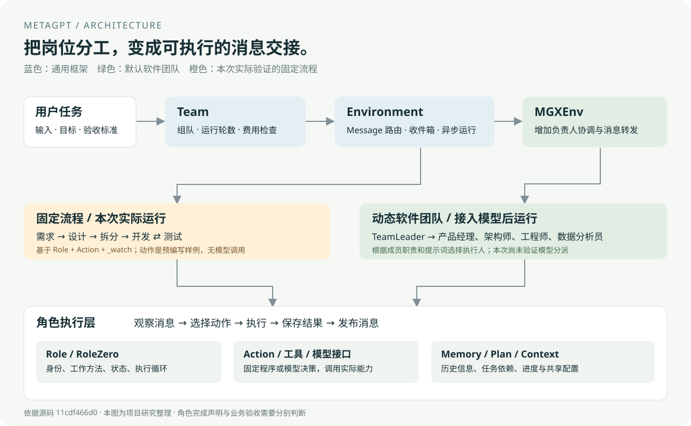

# 012 · MetaGPT 多 Agent 软件团队实验室

已获取原版 MetaGPT，完成独立安装和真实框架运行，并提供可操作的本机演示页。

| 项目资料 | 内容 |
| --- | --- |
| 上游 | [FoundationAgents/MetaGPT](https://github.com/FoundationAgents/MetaGPT) |
| 固定版本 | `11cdf466d042aece04fc6cfd13b28e1a70341b1f` |
| 许可证 | [MIT · Copyright 2024 Chenglin Wu](https://github.com/FoundationAgents/MetaGPT/blob/11cdf466d042aece04fc6cfd13b28e1a70341b1f/LICENSE) |
| 研究状态 | 已整理；固定流程已运行，模型推理尚未验证 |
| 本机环境 | Windows / Python 3.10.11 / 独立 `.venv` |
| 日期 | 2026-09-09 |

[← 返回总索引](../../README.md) · [在线演示](https://yydshly.github.io/0909_codex_project/projects/012-metagpt/) · [本机演示](http://127.0.0.1:8122) · [完整研究说明](web/research.md)

## 核心理解

提示词定义角色的职责与工作方法，模型提供推理和生成能力，工具执行实际操作，MetaGPT 负责角色状态、消息交接和异步运行。固定流程用事件触发下一角色；动态团队由负责人借助模型选择执行人，再由程序投递任务。定制 Agent 需要同时明确职责、输入、触发、动作、交付和验收。

完整研究涵盖两种调度方式、专用角色定制、27 个角色、产品扩展方向、Atoms 关联与实际验证边界。

## 你可以演示什么

打开本机页面，点击“重新运行协作”，实际启动原版框架：

**用户需求 → 产品经理 → 架构师 → 项目经理 → 开发工程师 → 测试工程师 → 返修 → 回归通过。**

- 点选 8 个交接步骤，查看触发消息和对应文件。
- 比较两版计算器代码：原价 100、券 20、折扣 0.9，错误版得到 70，修正版得到 72。
- 查看两轮真实 Python 测试输出：第一轮 7/8，通过返修后第二轮 8/8。
- 输入金额，实际调用交付的 `calculator.py`。
- 查看一张架构图和 27 个源码角色的分类、继承与源码链接。

**本次验证的是框架调度能力。** 5 个角色使用原版 `Role` 配合自定义固定 `Action`；需求文档、代码和修复规则预先编写，模型调用为零。它们不是直接运行库内置的 `ProductManager`、`Engineer` 或 `QaEngineer`。网页“播放回放”读取运行证据，“重新运行协作”才执行新一轮工作。



## 安装与启动

在此子项目目录执行 PowerShell 命令。需要 Git 和 uv；首次安装会下载 Python 环境和依赖。

```powershell
# 获取固定上游版本、安装依赖并执行演示
./runtime/setup.ps1

# 启动本机网页；浏览器访问 http://127.0.0.1:8122
.venv/Scripts/python.exe -X utf8 experiments/serve.py

# 单独重新运行，不必启动网页
.venv/Scripts/python.exe -X utf8 experiments/run_demo.py
```

当前源码已位于 `upstream/`，保持原样。上游要求的 `lancedb==0.4.0` 没有 Windows wheel，本项目仅在安装时覆盖成 `0.14.0`；覆盖文件和安装快照分别为 `runtime/windows-overrides.txt`、`runtime/requirements.lock.txt`。LanceDB 检索接口未验证，这项兼容处理不能代表全库兼容。

`runtime/local/runs/<运行编号>/` 保存每次实际文件与报告；`web/assets/run.json` 保存最近一次可公开的固定样例运行记录。上游、虚拟环境、本机配置和运行目录被 Git 忽略。静态托管页面可查看记录，重新运行和计算功能需要上述本机服务。线上发布到 GitHub Pages，提供运行回放、架构、角色目录和产物下载；本机执行能力不随静态页面部署。

## 接入真实模型

另有 `experiments/live_demo.py`，使用库内置 `DataInterpreter` 分析虚构销售数据并请求输出中文报告和图表。当前未检测到可用模型配置，因此此模式没有执行，也没有宣称通过。

```powershell
Copy-Item runtime/model.example.yaml runtime/config2.yaml
# 在本机填写 api_type、model、base_url 和 api_key
.venv/Scripts/python.exe -X utf8 experiments/live_demo.py --config runtime/config2.yaml
```

真实配置不提交到仓库、不通过网页输入。输出目标是 `runtime/local/live/analysis.md` 和 `sales.png`；该模式会调用模型并执行其生成的 Python 代码。若使用付费服务，会产生模型费用。脚本限制单次运行时间为 10 分钟；输出质量仍需验收。

## 文件导航

| 路径 | 用途 |
| --- | --- |
| `upstream/` | 原版源码，固定提交 |
| `experiments/run_demo.py` | 自定义动作、事件监听、测试与返修闭环 |
| `experiments/serve.py` | 本机网页、重新运行与计算接口 |
| `experiments/build_catalog.py` | 从源码提取角色目录 |
| `experiments/live_demo.py` | 需要模型配置的内置数据分析 Agent 入口 |
| `web/` | 可静态浏览的演示与运行证据 |
| `runtime/` | 安装脚本、配置模板、依赖快照、本机产物 |

本项目的图、页面和固定实验为新编写；上游库遵循其 MIT 许可。更多架构依据与边界见[研究说明](web/research.md)。
