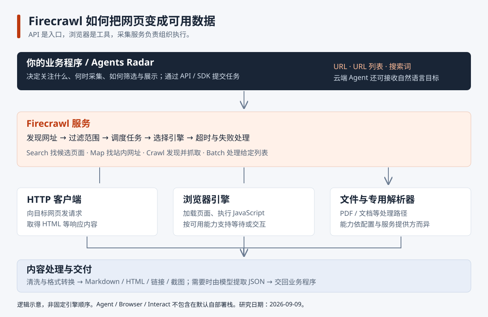

# 013 · Firecrawl 网页获取与能力实验室

Firecrawl 是网页数据获取服务：通过 API / SDK 接收网址、搜索词和任务，用 HTTP 请求、浏览器渲染、队列调度与内容转换获取网页，输出 Markdown、HTML 或结构化 JSON。它支持搜索、单页与批量抓取、爬站，以及云端交互与 Agent；适用于新闻补全文、知识库和信息提取，可扩展持续更新、行业字段、证据校验与质量监控。

浏览器是内部执行工具之一，SDK 是调用客户端；业务软件负责目标、周期、筛选和展示。登录与反爬支持不等于获得目标平台许可，也不保证账号不会受限或停用。

[在线能力展示](https://yydshly.github.io/0909_codex_project/projects/013-firecrawl/) · [整体关系图](web/assets/architecture.svg) · [调用示例](experiments/firecrawl_example.py)

| 项目资料 | 内容 |
| --- | --- |
| 上游仓库 | [firecrawl/firecrawl](https://github.com/firecrawl/firecrawl) |
| 核对日期 | 2026-09-09 |
| 上游 HEAD | `e847d994264f115fe672c4d40bfd2e70329c9243` |
| 研究状态 | 已整理 |
| 研究方式 | 官方文档、核心源码检查、独立教学展示与调用示例；未运行完整自部署栈 |
| 实测边界 | 匿名 POST 官方 `/v2/scrape` 返回 HTTP 403；未取得真实抓取成功样本 |
| 网页 | [本地展示入口](web/index.html)；接入总项目静态构建，发布状态见验证记录 |



## 我们逐步厘清的理解

### 1. 它只能接收 URL 吗？

不能把所有入口都理解为单页 URL 抓取。

| 入口 | 用户提供 | 服务返回 |
| --- | --- | --- |
| Scrape | 单个 URL 与输出选项 | 页面内容、元数据与所选格式 |
| Search | 搜索词，可附抓取选项 | 搜索结果，可进一步包含页面正文 |
| Map | 网站入口，可加主题 | 站内候选网址列表 |
| Crawl | 网站入口、范围、数量 | 多页面采集任务及结果 |
| Batch Scrape | 已知 URL 列表 | 批量任务及各页面结果 |
| JSON 模式 | URL、提示词、字段结构 | 语义提取后的 JSON |
| Interact | 抓取会话标识、操作指令 | 页面交互结果，可继续操作 |
| Agent | 自然语言采集目标，可选 URL / schema | Agent 搜索、导航与收集后的结果 |

以上是产品层面的功能清单；Agent、Browser、Interact 不包含在默认自部署栈。模型能力与专用服务需要配置，不能把云产品能力直接视为默认开源能力。[核心功能](https://github.com/firecrawl/firecrawl#feature-overview) · [部署对照](https://docs.firecrawl.dev/contributing/open-source-or-cloud)

### 2. 信息来自 RSS、HTML，还是网站 API？

核心网页抓取路径是访问目标网页，取得 HTML，或运行浏览器后读取加载出来的页面内容。

```text
你的程序 ──调用 Firecrawl API──> Firecrawl 服务
                                  │
                                  ├─ HTTP 请求目标网页，取得 HTML
                                  ├─ 浏览器加载页面，执行 JavaScript
                                  └─ 文档或专用来源处理路径
```

**调用 Firecrawl API，不等于调用目标网站的官方 API。** 前者是服务入口；后者是网站向开发者提供的数据接口。

- RSS：提供更新条目、标题、链接、摘要，有时包括全文；它不是普通网页抓取的主要机制。可以先读 RSS，再把文章链接交给 Firecrawl。
- HTML：普通请求得到网页代码，提取正文并转换格式。
- 浏览器：运行网页脚本，让动态内容加载出来。网页自己的脚本可能请求内部接口，之后 Firecrawl 读取页面，这与专门集成网站官方 API 有区别。
- 平台 API：像 Agents Radar 的 GitHub / HN 采集器，按平台规定直接获取结构化数据。Firecrawl 也有专用引擎，但不能据此推断它会自动发现并调用任意网站官方 API。

### 3. 它是不是一个模拟浏览器？

浏览器是其中一种执行工具，通常在服务端以无窗口方式运行。它能执行脚本，处理动态内容；可用引擎支持时，还能进行等待、点击或输入等操作。

但不必每个请求都使用浏览器。普通 HTTP 客户端可能已足够；文件类型有解析器；允许缓存时可能直接使用已有内容。引擎不是固定地依次全部执行，而是按请求功能、可用配置和策略选择。[引擎实现](https://github.com/firecrawl/firecrawl/blob/e847d994264f115fe672c4d40bfd2e70329c9243/apps/api/src/scraper/scrapeURL/engines/index.ts)

浏览器读取通常基于页面结构和文本，而不是截图后用模型识字。需要截图是另一种输出需求。

### 4. 为什么称为“大规模搜索、抓取和交互网络的 API”？

这句话描述对外提供的服务：搜索是找页面，抓取是读页面，交互是操作页面，API 是软件调用入口，大规模是批量、队列和并发执行的能力。实际规模受部署资源、额度、时间预算和网站访问情况约束。

### 5. 是不是提供 SDK，由用户自己调度？

双方分别负责不同层次。

| 层次 | 负责人 | 例子 |
| --- | --- | --- |
| 业务调度 | 你的程序 | 每天何时执行、关注什么、筛选标准、怎样生成日报 |
| 采集任务执行 | Firecrawl | Crawl 发现链接、按范围限制、排队、并发、失败处理 |
| 底层网页操作 | 抓取引擎 | HTTP 请求、页面加载、脚本执行、按能力进行交互 |

例如“抓取文档网站最多 100 页”可以作为一个 Crawl 任务提交，不需要业务程序逐一安排页面。SDK 只是访问服务的便捷客户端，安装 SDK 不会自动在本机部署整套爬虫。

## 内部信息获取原理

1. **网址发现。** Scrape 使用给定网址；Search 获取候选网址；Map 主要利用 Sitemap 并可补充搜索与历史爬取数据；Crawl 结合 Sitemap 和链接递归发现。Map 不是完整覆盖保证。
2. **配置与任务。** API 检查输入，批量或爬站路径创建任务；工作进程处理页面。当前仓库部署包括 API / Worker、Playwright、Redis、RabbitMQ 和 NuQ PostgreSQL，另有可选 FoundationDB 后端。
3. **引擎选择。** 根据目标类型、截图/交互等需求、缓存与服务配置，构建可用引擎列表。
4. **获取内容。** HTTP 读取响应，或浏览器运行页面；文件交给相应解析路径。失败、超时和后备执行由管线处理。
5. **内容转换。** 按选项选择内容，经过后处理和 HTML → Markdown 等转换。源码包括独立转换服务、Go 转换器和 Turndown 后备实现。基础转换不必调用模型。
6. **可选 AI 提取。** 模型读取正文与 schema / prompt，提取指定字段；字段符合结构不等于事实正确。
7. **返回与保存。** 结果附来源、页面状态等信息；异步任务通过状态查询等方式交付。业务系统应保存所需结果，避免把短期任务结果接口当作长期知识库。

重要区分：Firecrawl API 请求成功与目标网页成功是不同状态层。需要检查 `metadata.statusCode`，不能仅以 API 的 `success` 判断正文有效。`maxAge: 0` 可以要求重新采集，但不能证明网页描述的事件是最新的。

## 与 Agents Radar 的具体对照

对照采用我们已核对的 Agents Radar 版本 `dd2aaae700e2ebf62a7c80557c2bd64709be5e79`，不是对未来版本的承诺。

| 项目 | Agents Radar | Firecrawl |
| --- | --- | --- |
| 产品目的 | AI 生态信息采集、摘要、比较、双语报告、展示与通知 | 网页发现、内容获取、转换及交互服务 |
| 平台信息 | 直接适配 GitHub、HN 等 API | 可补充网页内容，不必替换成熟平台 API |
| 官网读取 | HTML 规整；Anthropic 文本最多 1500 字符 | 尝试更完整内容与动态页面处理 |
| OpenAI 官网 | Sitemap 元数据模式，标题由网址推导 | 可尝试正文采集，需实测成功率 |
| 清洗 | 关键词、时间、去重、热度排序、取样、文本截取 | 主要内容选择、格式转换，可选字段提取 |
| 模型用途 | 摘要、比较、趋势归纳、翻译 | 可选语义提取、Agent 规划等 |
| 调度 | 固定流程与定时运行 | 处理一次采集任务；云产品另有监控能力 |
| 最终输出 | 面向阅读的日报和通知 | 面向程序使用的页面内容与字段 |

建议接入路径：保留平台 API → 对重点文章 URL 使用 Firecrawl → 保存来源与正文 → 调整截断 / 分段摘要策略 → Radar 继续筛选、归纳和展示。

特别注意：抓到了全文后，如果后续仍只截开头 1500 字符，大部分增量信息依然无法进入模型。

## 登录网页、平台防护与账号风险

### 登录状态如何使用

本机浏览器已登录，不代表 Firecrawl 服务端浏览器也登录。普通登录网页可以按网站实际支持情况携带 Cookie / 认证请求头，或在云端 Interact 浏览器内完成登录并通过 profile 保存、复用状态。Cookie 和浏览器状态是访问凭证，不是内容数据；有效权限取决于目标网站的会话。

Firecrawl 的 headers 可以传请求头，profile 可保存 Cookie、localStorage 等状态。可写 profile 的状态在交互会话停止时保存；默认自部署不包含完整 Browser / Interact 服务。短信、扫码、二次验证、失效会话和目标站点风控，都可能需要用户重新处理，不能承诺任意登录网页均可稳定采集。[抓取参数](https://docs.firecrawl.dev/api-reference/endpoint/scrape) · [Interact 与 profile](https://docs.firecrawl.dev/features/interact)

### 被访问的平台会限制、封号吗？

会有这种可能。需要区分技术限制和账号规则：请求可能被拒绝、限流或要求验证；关联账号也可能被锁定、限制功能或停用。未登录的抓取请求与登录账号后的自动化请求，受影响的对象不完全相同，不能把一次 HTTP 403 直接判断为封号。

以 X 为例，2026 年 4 月更新的官方自动化规则明确将非 API 自动化（例如脚本操作 X 网站）列为禁止行为，并说明可能造成永久停用；官方帮助页也说明可疑自动化行为会触发账号锁定和验证。这是平台明确写出的风险，不是对某个账号处罚概率的测量。[X 自动化规则](https://help.x.com/en/rules-and-policies/x-automation) · [账号锁定与限制](https://help.x.com/en/managing-your-account/locked-and-limited-accounts)

使用真实浏览器、只读访问、本机执行、降低频率或代理，都不能推导出“不会被封”。Firecrawl 解决部分技术获取问题，不能替代平台许可或提供免封保证。平台返回限流、验证和拒绝时，应暂停、等待或完成正常授权流程。

### Siftly X 收藏库的三条路径

以下对照采用 Siftly 研究版本 `b25daa45b858f4be096b5c368671c34db4407d8e`。

| 路径 | 登录与取数机制 | 使用边界 |
| --- | --- | --- |
| 浏览器导出 JSON | 已登录的本机浏览器，脚本记录收藏页后续 fetch / XHR JSON 响应，导出后导入 Siftly | 只能记录成功捕获的内容；本机运行不豁免平台自动化规则 |
| Cookie 接入 | auth_token / ct0，程序请求 X 网页内部 GraphQL，按游标分页 | 内部接口不等于官方开放 API；会话与接口可能变化，仍有平台风控风险 |
| 官方 OAuth / API | 用户正式授权，取得访问令牌并调用官方收藏接口 | 优先评估；仍需权限、额度、分页和令牌管理，不能当作无条件免封 |

当前官方读取路径为 `GET https://api.x.com/2/users/{id}/bookmarks`，使用实际用户 ID 和适用的用户授权。所研究 Siftly 代码使用 `/2/users/me/bookmarks`，需要修正并实测；不应把源码中“已有 OAuth”理解为整个采集链路已验证可用。[Siftly 导入实现](https://github.com/viperrcrypto/Siftly/blob/b25daa45b858f4be096b5c368671c34db4407d8e/app/import/page.tsx) · [Cookie 实现](https://github.com/viperrcrypto/Siftly/blob/b25daa45b858f4be096b5c368671c34db4407d8e/lib/twitter-api.ts) · [OAuth 取数实现](https://github.com/viperrcrypto/Siftly/blob/b25daa45b858f4be096b5c368671c34db4407d8e/app/api/import/x-oauth/fetch/route.ts) · [X 官方收藏接口](https://docs.x.com/x-api/users/get-bookmarks)

建议组合：优先用符合平台规则的官方授权获取收藏列表 → Siftly 保存推文和链接 → Firecrawl 获取链接指向、允许采集的公开文章 → Siftly 分类、索引与展示。浏览器登录 X 后自动滚动提取只是技术上可尝试的路径，本研究未验证，也不推荐把重要账号用于未经平台允许的自动化试验。

本文档只记录机制和官方规则，不包含真实 Cookie、账号数据、令牌或登录采集实验。

## 能力展示的内容与边界

`web/index.html` 为独立制作的交互式教学页面：

- 八种能力选择：输入、处理步骤、结果示意、请求结构、官方依据。
- 四种获取方式对照：HTML、浏览器、RSS、平台 API。
- 整体关系图、调度分工和常见误解。
- Agents Radar 实现对照和建议接入方式。
- 登录状态与目标平台限制、X 账号风险、Siftly 三种取数路径。
- 本质、能力、原理、场景与可扩展方向的摘要。
- 下载本研究笔记和可调用真实服务的 Python 示例。

页面中的文章、产品、价格、URL 路径和结果均为人工编写的示意数据，不是 Firecrawl 的实测结果；切换按钮不会发出真实采集请求。未配置浏览器端 API Key 输入，以免将密钥暴露在静态网站中。

本轮尝试匿名请求 `POST https://api.firecrawl.dev/v2/scrape` 抓取 `https://example.com`，返回 HTTP 403。无法仅凭该状态判断是认证、网络防护或其他原因；没有将其记为抓取成功，也没有重试绕过访问限制。

## 如何使用真实服务

1. 在 [官方 Playground](https://www.firecrawl.dev/playground) 选取熟悉的页面验证。
2. 云服务调用设置 `FIRECRAWL_API_KEY`；或自行部署服务，并把可信服务地址设置为 `FIRECRAWL_BASE_URL`。
3. 使用 `experiments/firecrawl_example.py`（Python 标准库，无额外依赖）：

```sh
python experiments/firecrawl_example.py scrape https://example.com
python experiments/firecrawl_example.py search "AI 编程工具"
python experiments/firecrawl_example.py json https://example.com
```

脚本默认 `maxAge=0`，即重新抓取；搜索默认最多 5 个候选。真实云服务调用受账户额度与计费规则约束。JSON 模式还需要模型能力。输出为 API 原始 JSON，供检查来源、正文与页面状态。

## 可扩展方向与使用建议

以下是我们的应用建议，不是声称仓库已经实现的功能。

- **新闻雷达补全文：** 对重点线索抓正文，减少仅凭标题摘要作判断。
- **持续知识库：** 增量入库、分块、删除同步与引用回溯。
- **行业字段服务：** 用统一 schema 提取业务字段，再验证单位、缺失值和实体关系。
- **业务变化监控：** 基于已有变化检测和监控能力增加事件解释、去重与重要性判断。
- **质量与成本控制：** 记录成功率、正文完整度、字段准确率、延迟和每条有效记录成本。

不必为了使用 Firecrawl 而替换已经稳定、内容完整的 RSS 或官方 API。先找出现有采集的缺口，再验证补充价值。

## 来源索引

- [官方 Scrape](https://docs.firecrawl.dev/features/scrape)：输出、动态内容、状态与缓存。
- [官方 Search](https://docs.firecrawl.dev/features/search)：关键词与搜索后抓取。
- [官方 Map](https://docs.firecrawl.dev/features/map)：Sitemap、搜索补充与覆盖边界。
- [官方 Crawl](https://docs.firecrawl.dev/features/crawl)：范围、异步任务、错误记录。
- [官方 JSON 模式](https://docs.firecrawl.dev/features/llm-extract)：schema、模型提取、缺失字段和 HTML 属性限制。
- [变化检测](https://docs.firecrawl.dev/features/change-tracking)：前后快照比较与监控区别。
- [开源与云服务对照](https://docs.firecrawl.dev/contributing/open-source-or-cloud)。
- [抓取管线](https://github.com/firecrawl/firecrawl/blob/e847d994264f115fe672c4d40bfd2e70329c9243/apps/api/src/scraper/scrapeURL/index.ts)。
- [引擎选择](https://github.com/firecrawl/firecrawl/blob/e847d994264f115fe672c4d40bfd2e70329c9243/apps/api/src/scraper/scrapeURL/engines/index.ts)。
- [HTML 转 Markdown](https://github.com/firecrawl/firecrawl/blob/e847d994264f115fe672c4d40bfd2e70329c9243/apps/api/src/lib/html-to-markdown.ts)。
- [部署配置](https://github.com/firecrawl/firecrawl/blob/e847d994264f115fe672c4d40bfd2e70329c9243/docker-compose.yaml)。
- [Agents Radar 官网采集](https://github.com/duanyytop/agents-radar/blob/dd2aaae700e2ebf62a7c80557c2bd64709be5e79/src/web.ts)。
- [Agents Radar 主流程](https://github.com/duanyytop/agents-radar/blob/dd2aaae700e2ebf62a7c80557c2bd64709be5e79/src/index.ts)。

本项目文档、示意图和教学页面为独立研究产物；未复制上游完整代码或品牌素材。官方在线文档可能持续更新，源码链接固定在记录的版本。完整验证与本地预览记录见 [notes/verification.md](notes/verification.md)。
