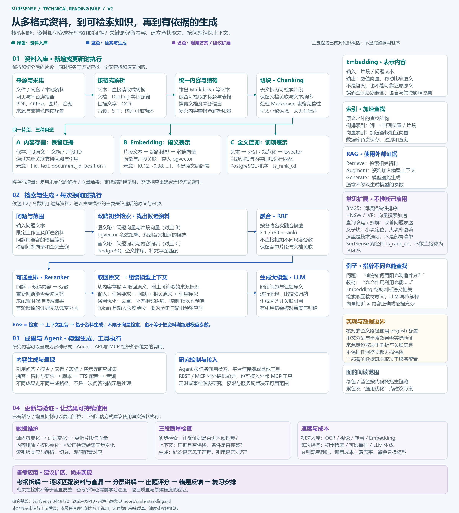

# 014 · SurfSense 研究与知识库实验室

SurfSense 将多格式资料解析、切块、Embedding、混合检索与大模型生成组织成可自行部署的研究平台，提供 NotebookLM 式引用问答与内容生成，并扩展实时数据、MCP 和自动化；附技术引导图，讲清向量表示、候选资料查找与 RAG 的分工，以及考纲覆盖、测验和复习的扩展路径。

本子项目首先用一张总架构图和能力—技术对照解释其 NotebookLM 式研究核心与后续强化，再提供研究场景、连接器探索和接入说明。**网页是独立教学实现，未运行 SurfSense 后端，没有调用模型或真实平台采集。**浏览器本地执行的是关键词匹配；预置归纳、业务资料及连接器输出均有明确标注。

[阅读完整理解汇总](notes/understanding.md) · [打开能力与架构首页](web/index.html#architecture) · [技术实现架构图](web/assets/technical-architecture.svg) · [能力演进图](web/assets/architecture.svg) · [来源与验证记录](notes/sources.md)

| 项目资料 | 内容 |
| --- | --- |
| 上游仓库 | [MODSetter/SurfSense](https://github.com/MODSetter/SurfSense) |
| 核对日期 | 2026-09-09 |
| 上游提交 | `3448772bd3d5d439114f810ac5da8e5a86967917` |
| 研究状态 | 已整理 |
| 研究方式 | 项目说明、核心源码阅读、独立静态教学展示 |
| 实测范围 | 本地展示的静态资源、JavaScript 语法、检索规则和总项目构建 |
| 上游实测 | 未部署；未验证平台连接、模型效果、采集速度或成功率 |
| 发布状态 | 已接入总项目清单与静态构建；本次未发布远程站点 |



[下载高清引导图](web/assets/readme-guide.png) · [查看可缩放引导图](web/assets/readme-guide.svg) · [查看组件技术架构](web/assets/technical-architecture.svg) · [查看能力演进图](web/assets/architecture.svg)

## 核心理解：资料如何成为模型的依据

- **Embedding 表示内容：**将资料片段和问题编码成兼容的语义向量，用于查找相关内容；生成模型通常仍读取对应原文。
- **初步检索找出候选：**也称“召回”。关键词与向量分别找出可能相关的资料，RRF 融合排名，再按配置使用重排模型精选。
- **RAG 串联检索与生成：**取回相关原文，附上问题、来源和要求组成上下文，再由大模型生成。它不限于向量检索，也不等于训练模型。
- **学习效果需要额外设计：**相关性检索不能保证全量考点覆盖；备考应用还需考纲对应、查漏、题目质量、测验反馈与复习安排。

引导图绿色展示入库，蓝色展示检索与生成，紫色展示通用方案和建议扩展。更多概念、同类项目和技术依据见[完整理解汇总](notes/understanding.md)。

## 先从能力与架构理解

首页技术图展开解析器适配、EtlResult 数据接口、Embedding、pgvector 混合检索、LLM、Agent 和缓存实现。保留的能力演进图呈现三个部分：

1. **原有资料研究核心：**资料解析与切分、Embedding 索引、知识库存储、研究 Agent、混合检索与可选重排序、模型问答、引用及播客。
2. **后续扩展和强化：**更广泛的平台实时数据、外部 MCP、更复杂的 Agent 编排、定时与事件触发、对外 MCP 和更多成果形式。
3. **共用基础设施：**界面与后端、模型适配、向量与文本存储、后台任务、工作区权限及部署。

**演进不是“早期只有 RAG，后来才有 Agent”。**核对的 [2025-08-29 README](https://github.com/MODSetter/SurfSense/blob/57d7c1c205fa9795bc8122a252a429c1d617528c/README.md) 已经列出 Agent、外部连接器、API、层级索引和播客。图中紫色表示后续强化方向，具体实现按研究版本整理，不代表这些技术首次出现的时间。

[下载架构 PNG](web/assets/architecture.png) · [查看可缩放 SVG](web/assets/architecture.svg)

### 能力与技术原理

| 能力 | 核心技术 |
| --- | --- |
| 读懂多种资料 | 文件解析、语音转写、按配置识图，统一文本并切分 |
| 找到相关资料 | Embedding 语义匹配、全文检索、RRF 排名融合、可选重排序 |
| 基于资料回答 | RAG：把问题与命中证据交给大模型，在查询时读取知识 |
| 回到原始依据 | 文档与片段标识、来源元数据，关联回答中的引用 |
| 生成播客 | 研究内容组织成对话脚本，再由 TTS 合成语音 |
| 使用实时网络 | 平台采集器通过适合的请求或浏览器路径获取并解析数据 |
| 接入与持续执行 | 对外 API/MCP、外部 MCP 工具、定时或事件触发 Agent |

## 如何体验

先阅读默认首页“能力与技术架构”。原有检索演示仍可从侧栏进入：

1. 在“研究体验”中选择竞品反馈、论文学习或团队入职场景。
2. 勾选允许检索的资料。初始页面展示预置样例；修改资料或问题后需要重新运行。
3. 点击“运行演示”，观察解析、检索、证据整理和引用关联的步骤。
4. 点击正文引用或右侧证据条目，阅读完整教学原文。
5. 下载本次证据笔记；笔记保留“教学样本、非实时采集”的说明。
6. 在“数据连接器”查看 8 组平台与扩展入口，在“实现原理”逐步查看 8 个环节及对应上游源码。

问题可以编辑。自定义问题返回匹配的原文片段，不冒充大模型回答；无匹配时显示空结果，不生成没有证据的结论。关闭全部资料后会提示选择来源。样例不是完整语义搜索，不支持任意自然语言理解。

## 上游能力

| 能力 | 输入与处理 | 典型产出 |
| --- | --- | --- |
| 私人知识库 | 上传文档、图片、音频，连接网盘、本地资料或网页 | 可查询的文档与片段 |
| 基于资料问答 | 语义与全文检索，排名融合，可选重排序，模型归纳 | 带证据引用的回答 |
| 实时网络研究 | 平台专用连接器获取公开内容 | 帖子、评论、字幕、搜索结果、地点、商品和职位等结构化条目 |
| 研究交付 | 将资料用于生成任务 | 报告、文档、表格、演示文稿、播客和视频概览 |
| Agent 扩展 | 内置工具与外部 MCP | 多步骤工具调用与研究执行 |
| 自动化 | 时间或事件触发，运行 Agent 任务 | 持续研究、摘要或向已配置服务写回 |
| 团队使用 | 共享工作区、聊天、评论与角色 | 协作研究与访问管理 |

上表依据上游产品说明与相关源码，能力可用性取决于版本、模型、连接器、权限和部署配置。生成播客或视频的体验不能从本演示推断；本演示不生成这些媒体。

## 实现原理

### 资料准备

文件进入统一提取流程，转换成 Markdown 等可索引文本。不同类型使用相应解析路径，图片可以启用视觉理解，音频需要转写。切分器保留文本顺序，对 Markdown 表格有专门处理。

索引流程识别重复内容和更新，调用 Embedding 模型生成语义向量，并保存文档、片段和来源信息。PostgreSQL 与 pgvector 提供结构化存储、全文搜索和向量相似度查询。

### 查询与生成

Agent 根据问题和可用工具调用检索、实时连接器或其他服务。知识库查询限定工作区和其他范围条件，语义搜索与全文查询各自产生排名，再用 Reciprocal Rank Fusion 合并：

```text
融合得分 = 1 / (60 + 语义排名) + 1 / (60 + 关键词排名)
```

缺少某一路结果时，该项记为 0。命中片段按文档组织；配置重排序模型时，再调整候选文档顺序。模型读取相关资料并生成回答，片段 ID 用于关联引用。

本子项目不模拟真实向量值或 RRF 分数，以免把教学排序误认成上游实测。流程页解释真实算法，研究页明确使用本地关键词匹配。

### 实时采集与 MCP

统一 API 后面是各平台的采集器。以核对的 Reddit 实现为例：浏览器建立会话，再通过 HTTP 复用会话读取 JSON，配合代理、分页、并发、限流处理和失败重试。其他平台不能据此假设完全相同实现。

MCP 服务将 SurfSense 的功能映射为模型工具，并通过后端 REST API 执行。它不直接导入后端实现；安装 MCP 服务也不等于已部署整个 SurfSense 平台。

## 使用场景与边界

- **竞品与反馈研究：**结合内部产品规划和公开反馈，形成有证据的改进线索；仍需评估样本代表性。
- **学习与技术研究：**比较资料中的方法和论据，形成学习笔记；引用不保证归纳正确。
- **团队知识与入职：**跨文档定位流程与负责人；真实权限必须由后端授权保证。
- **持续情报：**按时间或事件跟踪新内容；本展示不创建后台计划。
- **Agent 数据服务：**通过 REST API / MCP 为外部程序补充资料能力；需要可达后端、Key 和工作区授权。

中文检索需要实际验证：核对的全文检索使用 PostgreSQL `english` 配置，中文关键词处理可能需要适配。Embedding 模型也必须适合目标语言与领域。

自部署仍可能产生服务器、模型、解析及代理成本。资料是否留在本地取决于整条处理链的配置，不由“自托管界面”单独决定。

## 许可证

上游主体采用 Apache 2.0；`surfsense_backend/app/proprietary/` 下的组件采用 BSL 1.1，附加使用授权对向第三方提供商业产品、托管或管理服务有限制。它不是整个仓库统一 Apache 2.0。需二次开发为商业服务时，应以对应版本许可证为准。

本项目的展示界面、示意图和教学样本为独立编写；未复制上游应用源码或使用上游截图。源码链接固定到研究提交。

## 本地运行与维护

无需安装前端依赖。在总项目根目录执行：

```sh
python -m http.server 8014 --bind 127.0.0.1 --directory projects/014-surfsense/web
```

打开 `http://127.0.0.1:8014/`。总览通过现有目录构建：

```sh
python scripts/catalog.py sync
python scripts/catalog.py check
python scripts/catalog.py build
```

资源采用相对路径，兼容总项目的 GitHub Pages 子路径。`web/` 为源文件，`_site/` 为总项目生成目录。发布沿用总项目手动流程，本次没有推送或触发远程发布。
